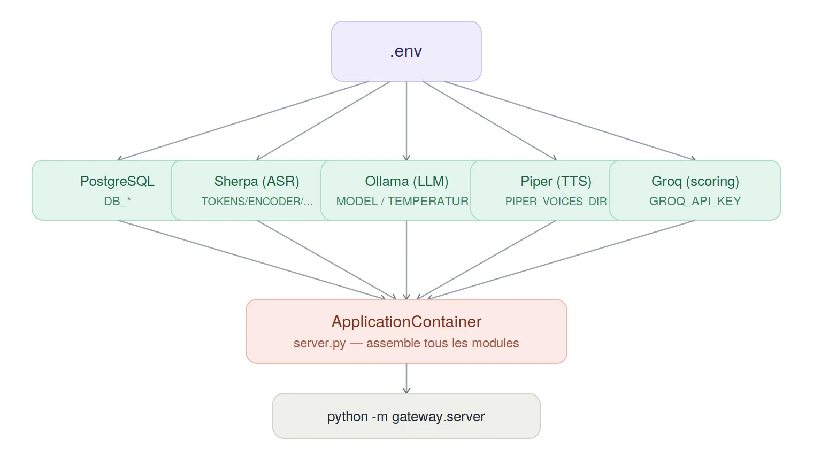

# Tuto de setup — InterviewMate (Windows)

Ce tuto couvre l'installation complète du projet en local, sur Windows
(CMD / PowerShell). Il permet de partir d'un poste vierge et d'arriver à
un `python -m gateway.server` qui tourne sans erreur.

> La version Linux (Helmi) suit le même plan — seules les commandes
> d'installation système changent (`apt` au lieu des installateurs
> `.exe`, `wget`/`rm` au lieu de `curl.exe`/`del`, etc.).

---

## TL;DR — checklist rapide

Pour ceux qui veulent juste vérifier qu'ils n'ont rien oublié :

```
[ ] venv créé + activé
[ ] PostgreSQL installé + les 3 tables créées (entretiens, echanges, rapports_scoring)
[ ] .env copié depuis .env.example et rempli
[ ] Ollama installé + modèle pull (ollama list confirme sa présence)
[ ] Modèles Sherpa (ASR) téléchargés dans models/sherpa/
[ ] Voix Piper (TTS) présentes dans le dossier configuré par PIPER_VOICES_DIR
[ ] GROQ_API_KEY renseignée dans .env
[ ] python -m gateway.server démarre sans erreur
```

Si une case coince, la section correspondante ci-dessous détaille quoi
faire.

---

## 0. Prérequis

| Outil | Version / info |
|---|---|
| Python | 3.12 |
| PostgreSQL | 14+ |
| Ollama | dernière version stable |
| Git | n'importe quelle version récente |
| Espace disque | ~5-10 Go (modèles ASR + TTS + LLM cumulés) |
| GPU | recommandé (accélère Ollama), pas obligatoire — CPU fonctionne, plus lent |

## 1. Vue d'ensemble

Tout le projet est piloté par un seul fichier `.env`, qui alimente cinq
services externes (base de données, ASR, LLM, TTS, scoring), tous
assemblés au démarrage par `ApplicationContainer` (`gateway/server.py`) :



---

## 2. Avant de commencer : mon PC peut-il faire tourner ça ?

Quelques vérifications rapides évitent de télécharger plusieurs Go de
modèles pour découvrir après coup que ça ne suit pas.

**Vérifier la VRAM disponible (si carte NVIDIA) :**
```powershell
nvidia-smi
```
Sinon : `Gestionnaire des tâches` → onglet `Performance` → `GPU` → ligne
`Mémoire GPU dédiée`.

**Vérifier la RAM totale :**
```powershell
systeminfo | findstr /C:"Mémoire physique totale"
```

**Vérifier l'espace disque libre :**
```powershell
Get-PSDrive C
```

---

## 3. Cloner le projet et préparer l'environnement Python

```powershell
git clone https://github.com/Helmisoudana/InterviewMate.git
cd InterviewMate
python -m venv venv
```

**Activer le venv** — la commande diffère selon le terminal :

CMD :
```cmd
venv\Scripts\activate.bat
```

PowerShell :
```powershell
venv\Scripts\Activate.ps1
```

> Si PowerShell refuse d'exécuter le script (erreur de policy
> d'exécution), lance une fois :
> ```powershell
> Set-ExecutionPolicy -Scope CurrentUser RemoteSigned
> ```

**Installer les dépendances :**
```powershell
pip install -r requirements.txt
```

---

## 4. Base de données PostgreSQL

### 4.1 Installation
Télécharger l'installateur officiel Windows sur
[postgresql.org/download/windows](https://www.postgresql.org/download/windows/),
installer avec les options par défaut. Retenir le mot de passe défini
pour l'utilisateur `postgres` (dans notre `.env` de référence,
c'est `admin123`).

### 4.2 Créer la base
```powershell
psql -U postgres
```
Puis, dans le prompt `psql` :
```sql
CREATE DATABASE interviewmate_db;
\c interviewmate_db
```

### 4.3 Créer les tables

Le schéma ci-dessous a été **vérifié directement en base** (`\d
nom_table`) sur une instance fonctionnelle du projet — pas une
reconstruction approximative.

```sql
-- Extension necessaire pour gen_random_uuid()
CREATE EXTENSION IF NOT EXISTS "pgcrypto";

-- ------------------------------------------------------------
-- Table 1 : entretiens
-- Une ligne par session d'entretien candidat.
-- ------------------------------------------------------------
CREATE TABLE IF NOT EXISTS entretiens (
    id UUID PRIMARY KEY DEFAULT gen_random_uuid(),
    session_id VARCHAR(64) UNIQUE NOT NULL,
    poste TEXT,
    langue TEXT,
    difficulte TEXT,
    timestamp TIMESTAMP,
    statut VARCHAR(20) DEFAULT 'EN_COURS'
);

-- ------------------------------------------------------------
-- Table 2 : echanges
-- Un tour de dialogue (question + reponse) par ligne.
-- Un couple (entretien_id, ordre) est unique.
-- ------------------------------------------------------------
CREATE TABLE IF NOT EXISTS echanges (
    id BIGSERIAL PRIMARY KEY,
    entretien_id UUID NOT NULL REFERENCES entretiens(id) ON DELETE CASCADE,
    ordre INTEGER NOT NULL,
    question_agent TEXT NOT NULL,
    reponse_candidat TEXT NOT NULL,
    qualite_percue VARCHAR(32),
    horodatage TIMESTAMP WITH TIME ZONE DEFAULT CURRENT_TIMESTAMP,
    UNIQUE (entretien_id, ordre)
);

-- ------------------------------------------------------------
-- Table 3 : rapports_scoring
-- Le rapport de notation final, une ligne unique par entretien.
-- ------------------------------------------------------------
CREATE TABLE IF NOT EXISTS rapports_scoring (
    id SERIAL PRIMARY KEY,
    entretien_id UUID UNIQUE REFERENCES entretiens(id) ON DELETE CASCADE,
    score_global NUMERIC(4, 2) NOT NULL,
    score_technique NUMERIC(4, 2),
    score_communication NUMERIC(4, 2),
    points_forts TEXT[],
    points_faibles TEXT[],
    recommandations TEXT[],
    evaluations JSONB DEFAULT '[]'::jsonb,
    date_creation TIMESTAMP WITH TIME ZONE DEFAULT CURRENT_TIMESTAMP
);
```

Sauvegarde ce bloc dans un fichier, par exemple `schema_complet.sql`,
puis exécute-le :
```powershell
psql -U postgres -d interviewmate_db -f schema_complet.sql
```

> Si le projet possède déjà des fichiers de migration numérotés dans
> `storage/infrastructure/migrations/`, préfère les lancer dans l'ordre
> plutôt que ce script unique :
> ```powershell
> psql -U postgres -d interviewmate_db -f storage/infrastructure/migrations/001_xxx.sql
> psql -U postgres -d interviewmate_db -f storage/infrastructure/migrations/002_create_rapports_scoring.sql
> ```

### 4.4 Vérifier

```powershell
psql -U postgres -d interviewmate_db -c "\dt"
```
Doit lister : `entretiens`, `echanges`, `rapports_scoring`.

```powershell
psql -U postgres -d interviewmate_db -c "\d rapports_scoring"
```
Pour inspecter une table en détail (colonnes, types, contraintes,
clés étrangères).

---

## 5. Le fichier `.env`

### 5.1 Le concept

- **`.env.example`** est versionné sur Git : un modèle sans aucun secret
  réel, juste la liste des clés attendues avec des valeurs factices.
- **`.env`** est local à ta machine, listé dans `.gitignore`, **jamais
  commité** — c'est là que vont tes vrais mots de passe et clés API.

### 5.2 La commande

Sous Windows, l'équivalent de `cp` est `copy` :
```powershell
copy .env.example .env
```

Ouvre ensuite `.env` avec ton éditeur et remplis chaque valeur.

### 5.3 Tableau de toutes les variables

| Variable | Rôle |
|---|---|
| `DB_HOST` / `DB_PORT` / `DB_NAME` / `DB_USER` / `DB_PASSWORD` | Connexion PostgreSQL |
| `HOST` / `PORT` | Adresse et port d'écoute du serveur WebSocket (`gateway`) |
| `WHISPER_MODEL_PARTIEL` / `WHISPER_MODEL_FINAL` | Tailles de modèle Whisper (si ce backend ASR est utilisé) |
| `WHISPER_DEVICE` / `WHISPER_COMPUTE_TYPE` | `cpu`/`cuda`, précision de calcul (`int8`, `float16`...) |
| `PIPER_VOICES_DIR` | Dossier contenant les fichiers de voix `.onnx` pour la synthèse vocale |
| `DEFAULT_VOICE` | Voix Piper utilisée par défaut (ex: `fr_FR-siwis-medium`) |
| `OLLAMA_MODEL` | Nom du modèle Ollama (attention : le module `agent` lit en réalité `MODEL`, pas `OLLAMA_MODEL` — vérifier laquelle des deux clés ton code utilise réellement) |
| `SEUIL_SILENCE_MS` | Seuil de silence (ms) pour la détection de fin de parole côté frontend/gateway |
| `DEFAULT_LANGUAGE` | Langue par défaut de l'entretien |
| `TOKENS` / `ENCODER` / `DECODER` / `JOINER` | Chemins vers les fichiers du modèle Sherpa (ASR streaming) |
| `NUM_THREADS` | Nombre de threads CPU alloués à Sherpa |
| `PROVIDER` | `cpu` ou `cuda` pour Sherpa |
| `SAMPLE_RATE` | Fréquence d'échantillonnage attendue (16000 Hz dans tout le pipeline) |
| `FEATURE_DIM` | Dimension des features acoustiques du modèle Sherpa (ne pas modifier sans changer de modèle) |
| `DECODING_METHOD` | `greedy_search` (rapide) ou `modified_beam_search` (plus précis, plus lent) |
| `ENABLE_ENDPOINT_DETECTION` | Active la détection de fin de tour native de Sherpa |
| `RULE1/2/3_MIN_TRAILING_SILENCE` / `RULE3_MIN_UTTERANCE_LENGTH` | Seuils de silence/durée pour la détection de fin de tour |
| `MODEL` | Nom exact du modèle Ollama à utiliser (doit correspondre à `ollama list`) |
| `NUM_PREDICT` | Nombre max de tokens générés par réponse LLM |
| `KEEP_ALIVE` | Durée pendant laquelle Ollama garde le modèle chargé en mémoire entre deux appels |
| `TEMPERATURE` | Créativité du LLM (0 = déterministe, 1 = très varié) |
| `GROQ_API_KEY` | Clé API Groq — **jamais commitée, jamais partagée en clair** |
| `GROQ_MODEL` | Modèle Groq utilisé pour le scoring (ex: `openai/gpt-oss-120b`) |
| `PROMPT_SYSTEME_SCORING_PATH` | Chemin vers le prompt système du module `scoring` |

> ⚠️ **Sécurité** : si une clé API se retrouve un jour dans un commit,
> un chat, ou tout autre endroit visible par d'autres personnes,
> considère-la compromise et **régénère-la immédiatement** depuis la
> console du fournisseur (Groq, etc.). Ne jamais réutiliser une clé
> exposée, même après l'avoir supprimée du texte.

---

## 6. Installer et faire tourner Ollama

### 6.1 Installation
Télécharger et installer depuis [ollama.com](https://ollama.com/download/windows).
Une fois installé, Ollama tourne en service d'arrière-plan
automatiquement — pas besoin de lancer `ollama serve` manuellement.

### 6.2 Télécharger un modèle
```powershell
ollama pull llama3
```

### 6.3 Vérifier
```powershell
ollama list
```
Le nom affiché dans la colonne `NAME` (ex: `llama3:latest`) doit
correspondre — sans le `:latest` — à la valeur de `MODEL` dans ton
`.env` :
```dotenv
MODEL=llama3
```

---

## 7. Choisir son modèle Ollama selon sa VRAM

| VRAM disponible | Modèles conseillés | Ce que ça donne |
|---|---|---|
| ≤ 4 Go | `qwen2.5:3b`, `phi3:mini` | Rapide, réponses parfois moins riches |
| 6 Go | `qwen2.5:3b` confortable, `llama3:8b` en limite haute | Bon compromis vitesse/qualité |
| 8-12 Go | `llama3:8b` confortable, `mistral:7b` | Fluide |
| 16 Go+ | `mixtral`, gros modèles quantisés | Qualité maximale, lent si ça bascule sur CPU |

**Astuces mémoire :**
- `NUM_THREADS` (côté Sherpa) et le nombre de threads CPU alloués à
  Ollama se disputent les mêmes ressources — sur une machine à cœurs
  limités, un modèle Ollama trop gros peut ralentir tout le reste du
  pipeline pendant sa génération.
- `KEEP_ALIVE=30m` garde le modèle chargé en mémoire 30 minutes après le
  dernier appel — évite de le recharger à chaque question, mais occupe
  la VRAM en continu pendant ce temps.

---

## 8. Clé API Groq

1. Créer un compte et une clé sur [console.groq.com](https://console.groq.com/keys)
2. La coller dans `.env`, jamais ailleurs :
   ```dotenv
   GROQ_API_KEY=ta_vraie_cle_ici
   ```
3. Le plan gratuit a un quota limité — si le scoring échoue avec une
   erreur de quota, vérifier la console Groq.

---

## 9. Modèles ASR (Sherpa)

### 9.1 Télécharger
```powershell
cd models\sherpa
curl.exe -L -o nom-du-modele.tar.bz2 https://github.com/k2-fsa/sherpa-onnx/releases/download/asr-models/nom-du-modele.tar.bz2
```

### 9.2 Décompresser
```powershell
tar xvf nom-du-modele.tar.bz2
del nom-du-modele.tar.bz2
```

### 9.3 Configurer le `.env`
Faire pointer `TOKENS`, `ENCODER`, `DECODER`, `JOINER` vers les fichiers
extraits, par exemple :
```dotenv
TOKENS=models/sherpa/sherpa-onnx-streaming-zipformer-fr-2023-04-14/tokens.txt
ENCODER=models/sherpa/sherpa-onnx-streaming-zipformer-fr-2023-04-14/encoder-epoch-29-avg-9-with-averaged-model.int8.onnx
DECODER=models/sherpa/sherpa-onnx-streaming-zipformer-fr-2023-04-14/decoder-epoch-29-avg-9-with-averaged-model.onnx
JOINER=models/sherpa/sherpa-onnx-streaming-zipformer-fr-2023-04-14/joiner-epoch-29-avg-9-with-averaged-model.int8.onnx
```

> ⚠️ N'utilise **pas** `curl` seul (sans `.exe`) en PowerShell : c'est un
> alias vers `Invoke-WebRequest`, qui n'accepte pas les mêmes options
> (`-L`, `-o`) que le vrai `curl`. Toujours écrire `curl.exe` sous
> PowerShell.

---

## 10. Lancer le serveur

```powershell
python -m gateway.server
```

Les logs s'écrivent dans `logs/server.log`. Un démarrage réussi affiche
le chargement des modèles (Sherpa / Piper / Ollama) puis confirme que le
serveur WebSocket écoute sur `ws://0.0.0.0:8765`.

---

## 11. FAQ — erreurs déjà rencontrées

**`KeyError: 'TOKENS'`**
Une variable attendue dans `.env` est absente ou mal nommée. Vérifier
que `.env` existe bien à la racine du projet (là où la commande est
lancée) et que la variable manquante y figure exactement avec ce nom.

**`Invoke-WebRequest : Impossible de trouver un paramètre correspondant au nom «L»`**
`curl` a été appelé en PowerShell sans `.exe` — utiliser `curl.exe`.

**`TypeError: XxxUseCase.executer() missing 1 required positional argument`**
Une signature de méthode a changé côté d'un fichier (souvent après un
`git pull`), mais l'appelant n'a pas été mis à jour en conséquence.
Comparer la signature réelle de la méthode avec l'appel qui échoue.

**`groq._base_client.APITimeoutError`**
Timeout réseau vers l'API Groq — pas un bug de code. Vérifier la
connexion, éventuellement augmenter le `timeout` du client Groq dans
l'adapter concerné.

**`ValueError: GROQ_API_KEY manquante`**
Le script lancé ne charge pas le `.env` — vérifier qu'il contient bien
`from dotenv import load_dotenv` suivi de `load_dotenv()` tout en haut du
fichier, et que la commande est lancée depuis la racine du projet.

**`psql: error: ... authentification par mot de passe échouée`**
Mot de passe PostgreSQL incorrect au moment du login — vérifier
`DB_PASSWORD` dans `.env` contre le vrai mot de passe défini à
l'installation.

---

## 12. Pourquoi ces choix techniques

- **Ollama en local plutôt qu'un LLM cloud** pour la conduite
  d'entretien (`agent`) : gratuit, rapide en aller-retour, et les
  échanges restent sur la machine — pas de coût récurrent par question
  posée pendant le développement/les tests.
- **Groq plutôt qu'Ollama pour le scoring** : le scoring est un appel
  unique par entretien (pas répété à chaque tour comme `agent`), et
  bénéficie d'un modèle plus gros et plus précis (`openai/gpt-oss-120b`)
  que ce qu'une machine locale peut faire tourner confortablement —
  l'appel réseau ponctuel est un compromis acceptable pour la qualité du
  rapport final.
- **Piper pour la synthèse vocale** : léger, tourne en local sans GPU
  obligatoire, latence de streaming faible — adapté à un usage temps réel
  candidat/agent.
- **Sherpa (zipformer streaming) pour la reconnaissance vocale** :
  conçu nativement pour du streaming incrémental (transcription au fil
  de la parole), contrairement à des modèles offline comme Whisper qui
  transcrivent un segment complet a posteriori.

---

## 13. Où trouver quoi

| Je cherche... | C'est où |
|---|---|
| Les logs du serveur | `logs/server.log` |
| Les voix Piper | dossier indiqué par `PIPER_VOICES_DIR` dans `.env` |
| Les modèles ASR | `models/sherpa/` |
| Changer de modèle Ollama | `.env` → `MODEL` |
| Le prompt système du scoring | chemin indiqué par `PROMPT_SYSTEME_SCORING_PATH` |
| Le schéma des tables | section 4.3 de ce tuto, ou `storage/infrastructure/migrations/` |

---

## 14. Pour aller plus loin

Chaque module du projet a son propre `README.md`, avec son
architecture détaillée et son propre point d'entrée de test isolé
(`dev_runner.py`) :

- `agent/README.md`
- `scoring/README.md`
- `storage/README.md`
- `tts/README.md`
- `asr/README.md` 
- `gateway/README.md` 

---

## 15. Pièges Windows spécifiques

- **CMD vs PowerShell vs Git Bash** : privilégier un seul terminal pour
  tout le setup (ce tuto utilise PowerShell). Les commandes
  d'activation du `venv` et certains alias (`curl`, `del` vs `rm`)
  diffèrent d'un terminal à l'autre — mélanger les deux est une source
  d'erreurs fréquente.
- **Chemins avec espaces ou accents** : un chemin de projet du type
  `C:\Users\nom\OneDrive - Mon Organisation\Bureau\InterviewMate`
  fonctionne, mais toujours entourer le chemin de guillemets dans les
  commandes (`cd "chemin avec espaces"`), sinon certaines commandes le
  découpent au premier espace.
- **`curl` sans `.exe` en PowerShell** : c'est un alias vers
  `Invoke-WebRequest`, qui n'accepte pas `-L`/`-o` comme le vrai `curl`
  — toujours écrire `curl.exe` explicitement.