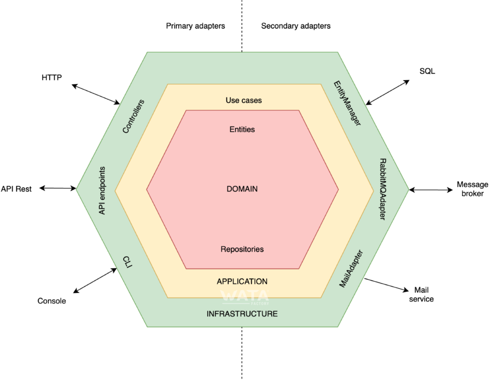
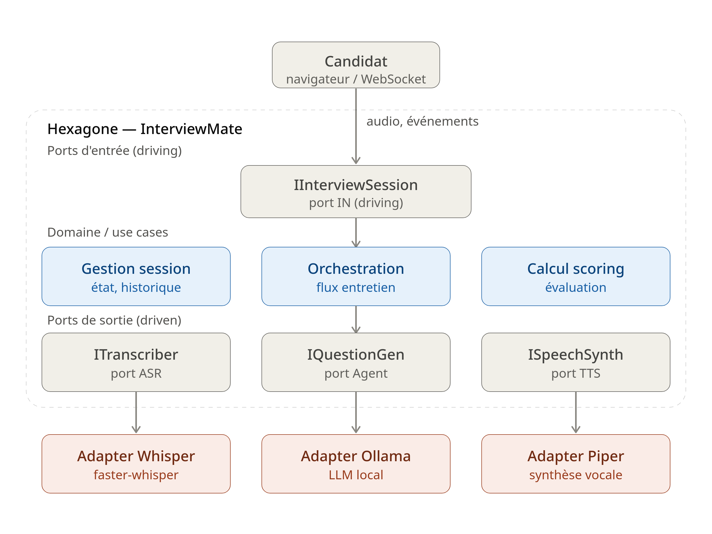
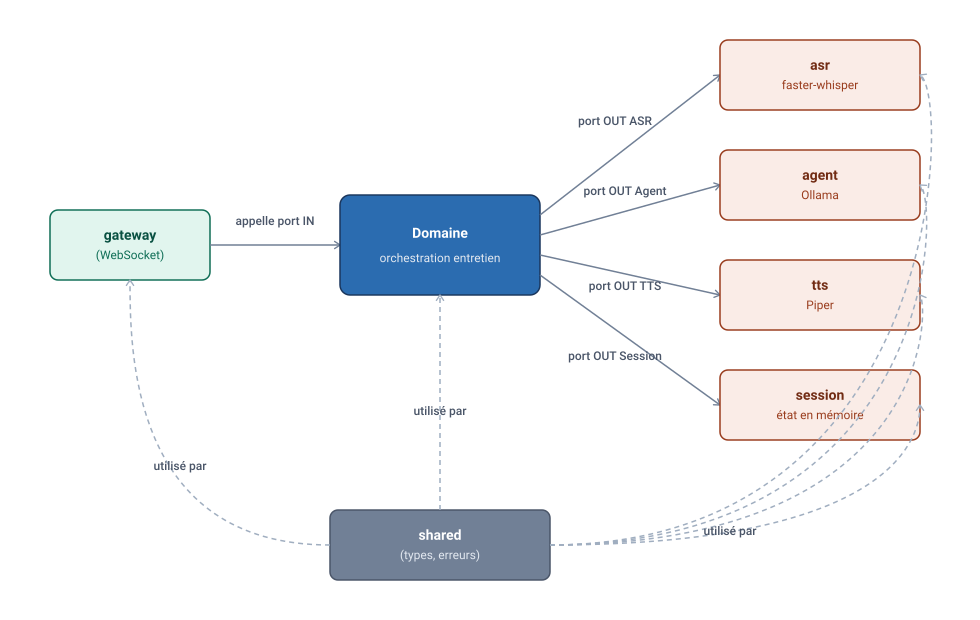
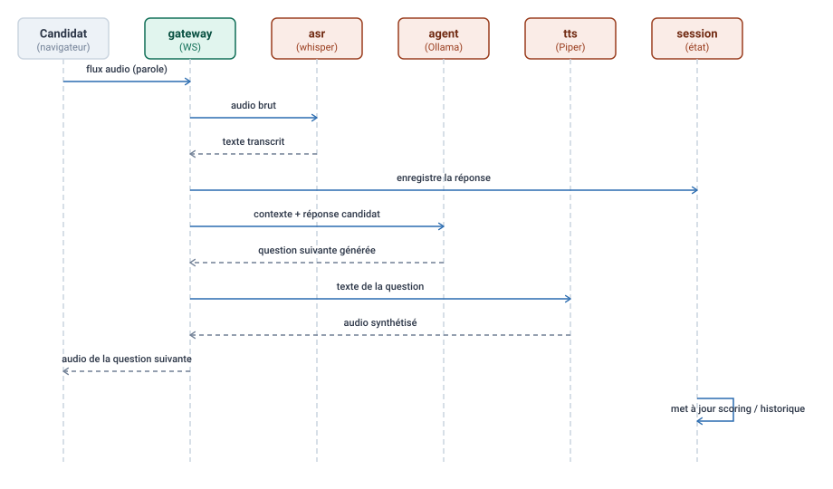
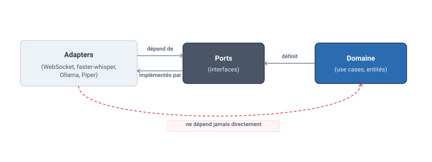

# InterviewMate — Architecture Hexagonale

> Simulateur d'entretien vocal en Python, construit en **monolithe modulaire** suivant le pattern **Ports & Adapters** (architecture hexagonale).

---

## Sommaire

- [Pourquoi une architecture hexagonale](#pourquoi-une-architecture-hexagonale)
- [Vue d'ensemble](#vue-densemble)
- [Schéma général de l'hexagone](#schéma-général-de-lhexagone)
- [Les 6 modules](#les-6-modules)
- [Flux d'un entretien (pipeline temps réel)](#flux-dun-entretien-pipeline-temps-réel)
- [Structure des dossiers](#structure-des-dossiers)
- [Règle de dépendance](#règle-de-dépendance)
- [Installation](#installation)
- [Conventions de code](#conventions-de-code)

---

## Pourquoi une architecture hexagonale

L'architecture hexagonale (aussi appelée **Ports & Adapters**, introduite par Alistair Cockburn) sépare le **cœur métier** (domain/use cases) de tout ce qui est **technique** (WebSocket, modèles ML, base de données, etc.).

Objectifs recherchés dans InterviewMate :

- **Testabilité** : le cœur métier (génération de questions, scoring, logique d'entretien) se teste sans dépendre de Whisper, Piper ou Ollama.
- **Interchangeabilité** : remplacer `faster-whisper` par un autre moteur ASR, ou `Ollama` par une autre API LLM, sans toucher au métier.
- **Isolation des frameworks** : FastAPI/WebSocket n'est qu'un détail d'implémentation, pas le centre de l'application.

---

## Vue d'ensemble

Le principe : le **domaine** (au centre) ne connaît **aucune** dépendance technique. Il expose des **ports** (interfaces). Les **adapters** (à l'extérieur) implémentent ces ports pour connecter le monde réel (WebSocket, IA, audio) au domaine.



---

## Schéma général de l'hexagone



**Lecture du schéma** : les flèches partent toujours du monde extérieur vers le domaine (ports d'entrée), et du domaine vers le monde extérieur (ports de sortie). Le domaine ne dépend **jamais** directement de `faster-whisper`, `Ollama` ou `Piper` — seulement de leurs interfaces (ports).

---

## Les 6 modules

InterviewMate est découpé en 6 modules, chacun avec sa propre frontière hexagonale interne :

| Module    | Rôle                                                              | Type d'adapter        |
|-----------|--------------------------------------------------------------------|------------------------|
| `shared`  | Types, exceptions, utilitaires communs à tous les modules         | —                      |
| `gateway` | Point d'entrée WebSocket, reçoit l'audio du candidat               | Adapter **primaire** (driving) |
| `asr`     | Transcription vocale via `faster-whisper`                          | Adapter **secondaire** (driven) |
| `agent`   | Génération des questions d'entretien via `Ollama`                  | Adapter **secondaire** (driven) |
| `tts`     | Synthèse vocale via `Piper`                                        | Adapter **secondaire** (driven) |
| `session` | État de session en mémoire (historique, scoring, progression)      | Adapter **secondaire** (driven) |




---

## Flux d'un entretien (pipeline temps réel)



Chaque flèche technique (`faster-whisper`, `Ollama`, `Piper`, WebSocket) passe **obligatoirement** par un port défini dans le domaine — aucun module ne connaît l'implémentation concrète d'un autre.

---

## Structure des dossiers

```
InterviewMate/
├── shared/
│   ├── domain/             # types, exceptions communs
│   └── contracts/          # contrats & interfaces partagés
├── gateway/
│   ├── domain/             # ports IN (interfaces de session)
│   ├── application/        # use cases d'entrée
│   └── adapters/
│       └── websocket/      # implémentation WebSocket (FastAPI)
├── asr/
│   ├── domain/             # port ITranscriber
│   ├── application/        # cas d'usage de transcription
│   └── adapters/
│       └── sherpa/         # implémentation concrète (Sherpa-onnx)
├── agent/
│   ├── domain/             # port IQuestionGenerator
│   ├── application/        # cas d'usage de l'agent IA
│   └── adapters/
│       └── ollama/         # implémentation concrète
├── tts/
│   ├── domain/             # port ISpeechSynthesizer
│   ├── application/        # cas d'usage de synthèse vocale
│   └── adapters/
│       └── piper/          # implémentation concrète
├── session/
│   ├── domain/             # port ISessionRepository
│   ├── application/        # cas d'usage de gestion de session
│   └── adapters/
│       └── in_memory/      # état de session en mémoire
└── storage/
    ├── domain/             # port IDataStorage / interfaces de persistance
    ├── application/        # cas d'usage de stockage & requêtes
    └── adapters/
        └── postgres/       # implémentation concrète (PostgreSQL)
```

Convention appliquée dans chaque module : `domain/` (ports + entités + use cases) ne dépend de **rien** d'externe ; `adapters/` implémente les ports en s'appuyant sur des librairies tierces.

---

## Règle de dépendance




> **Règle d'or** : les flèches de dépendance pointent toujours **vers l'intérieur** (des adapters vers le domaine), jamais l'inverse. Le domaine ignore totalement l'existence de `faster-whisper`, `Ollama` ou `FastAPI`.


## Conventions de code

- Chaque module expose ses **ports** dans `domain/ports/` (interfaces abstraites, via `abc.ABC` ou `Protocol`).
- Chaque **adapter** implémente un port et vit dans `adapters/<nom_techno>/`.
- Aucun import direct d'une librairie tierce (`faster_whisper`, `ollama`, `piper`) en dehors du dossier `adapters/` correspondant.
- Les use cases du domaine sont injectés avec leurs dépendances via **injection de dépendances** (constructeur), jamais instanciés en dur.

.svg)

---


*README généré pour la partie architecture du projet InterviewMate.*