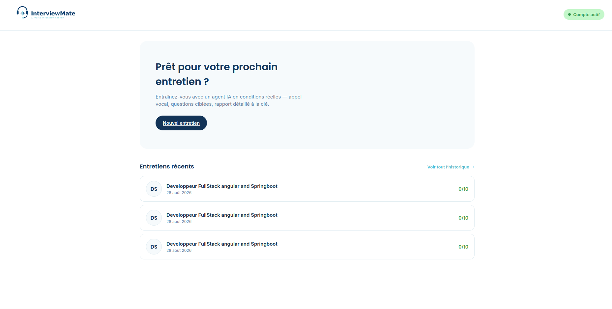
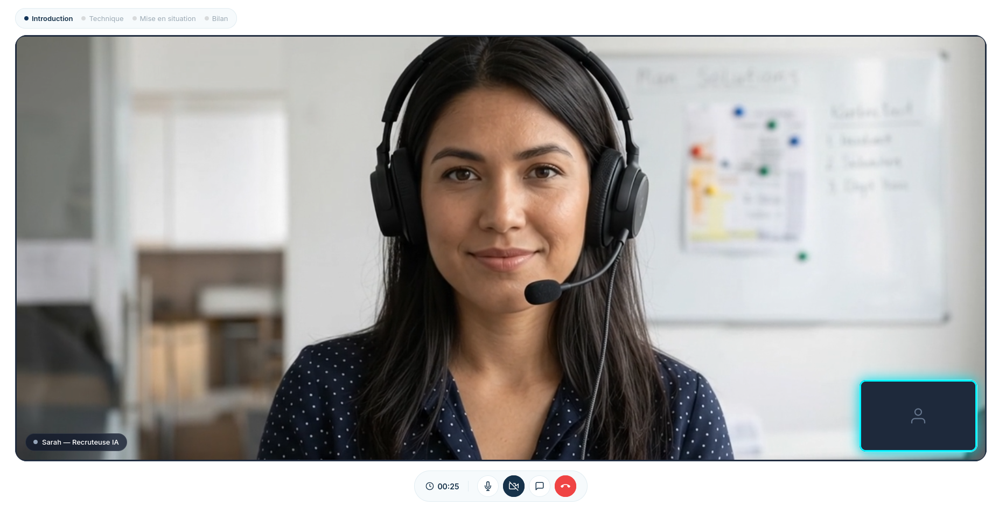
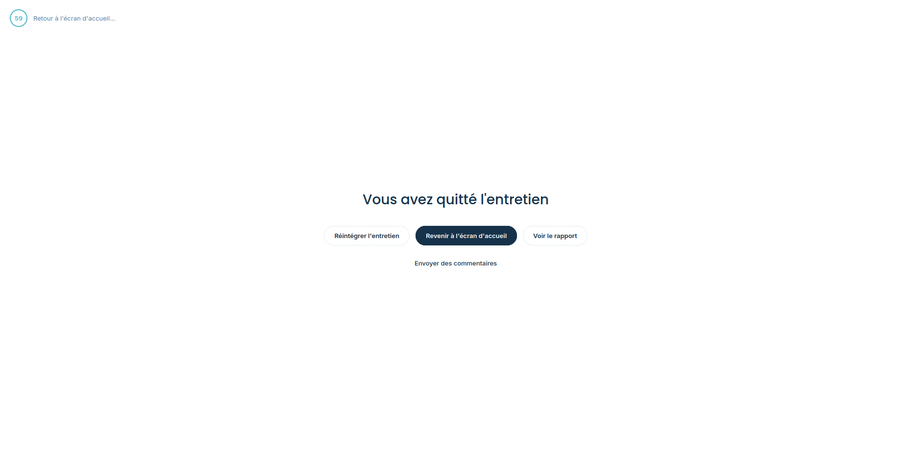
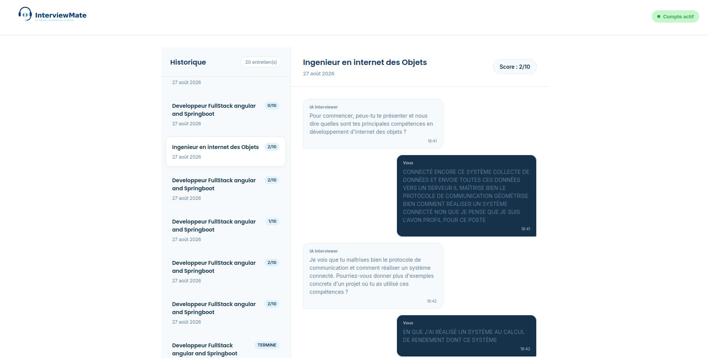
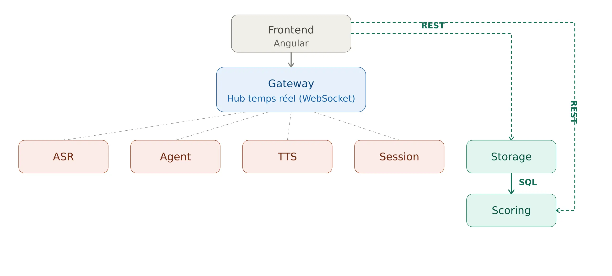
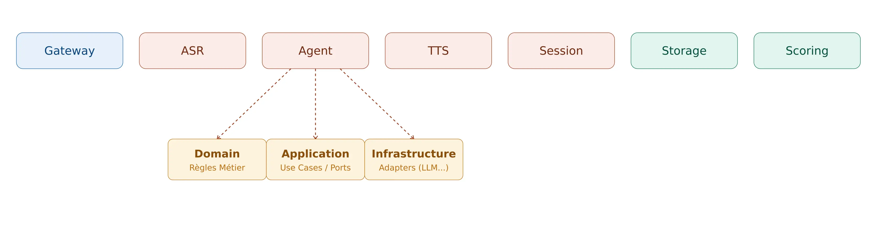
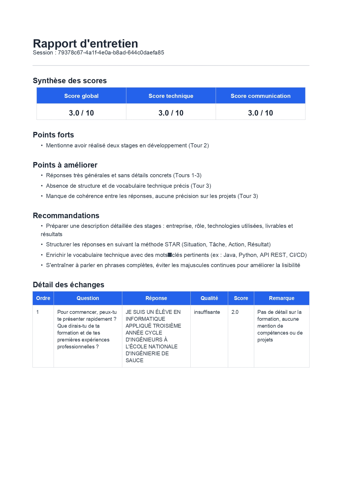
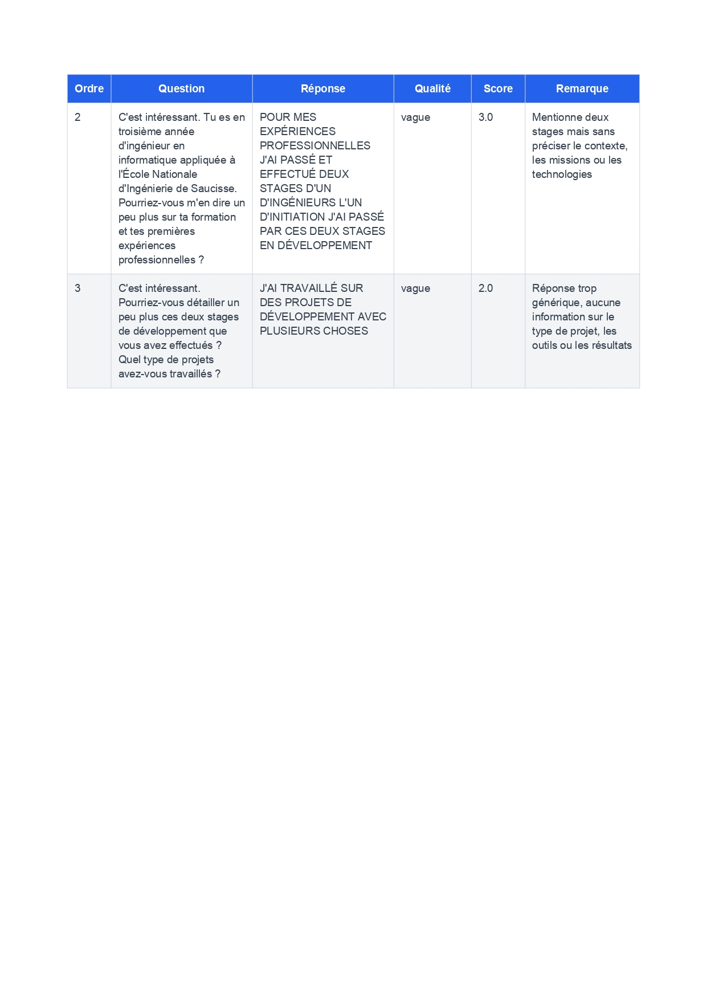

  

<h1 align="center">Interview Mate</h1>

  Simulation d'entretien d'embauche assistée par IA, en conditions réelles et en temps réel.

  
  
  
  
  
  

---

## Sommaire

- [C'est quoi Interview Mate ?](#cest-quoi-interview-mate-)
- [Fonctionnalités](#fonctionnalités)
- [Démo](#démo)
- [Aperçu de l'interface](#aperçu-de-linterface)
- [Stack technique](#stack-technique)
- [Architecture](#architecture)
- [Les modules](#les-modules)
- [Exemple de rapport de scoring](#exemple-de-rapport-de-scoring)
- [Installation](#installation)
- [Statut du projet](#statut-du-projet)
- [Auteur](#auteur)
- [Licence](#licence)

---

## C'est quoi Interview Mate ?

**Interview Mate** est une application de simulation d'entretien d'embauche assistée par IA. Le candidat parle à voix haute, un agent IA l'écoute, lui pose des questions, rebondit sur ses réponses, ajuste la difficulté et clôture l'entretien comme le ferait un vrai recruteur.

Concrètement, le candidat :

- choisit un **poste**, une **langue** et une **durée** d'entretien,
- **parle** dans son micro, comme dans un vrai entretien,
- **entend** les questions et relances de l'agent IA en voix synthétisée,
- reçoit à la fin un **retour structuré** sur sa prestation.

Tout se passe en flux continu (audio → texte → décision → voix), sans rupture, grâce à une [architecture hexagonale](Docs/architecture-hexagonale.md) et modulaire connectée en temps réel.

## Fonctionnalités

- Entretien vocal en temps réel, sans rupture de flux
- Choix du poste, de la langue et de la durée de l'entretien
- Agent IA qui adapte ses questions et relances aux réponses du candidat
- Transcription et synthèse vocale intégrées
- Rapport de scoring structuré généré en fin d'entretien
- Historique des entretiens passés

## Démo

  

## Aperçu de l'interface

> Interface en cours de finalisation — les captures ci-dessous reflètent l'état actuel du développement.

<table align="center">
  <tr>
    <td align="center">
       
      Page d'accueil
    </td>
    <td align="center">
       
      Entretien en cours
    </td>
  </tr>
  <tr>
    <td align="center">
       
      Fin d'entretien
    </td>
    <td align="center">
       
      Historique des entretiens
    </td>
  </tr>
</table>

## Stack technique

| Composant | Techno |
| :--- | :--- |
| Backend | Python |
| Frontend | Angular |
| Communication temps réel | WebSocket |
| Transcription (ASR) | faster-whisper |
| Agent IA | Ollama (LLM local) |
| Synthèse vocale (TTS) | Piper |
| Architecture | Hexagonale (ports & adapters), monolithe modulaire |

## Architecture Hexagonale

  

Chaque flèche entre le Gateway et un module correspond à une liaison **in-process** via un adapter qui implémente un port — voir le [README du Gateway](gateway/README.md) pour le détail.

Le détail complet du pattern ports & adapters est documenté dans [`Docs/architecture-hexagonale.md`](Docs/architecture-hexagonale.md).

## Les modules

Chaque module est indépendant, testable isolément et documenté séparément :

  

| Module | Description | Documentation |
| :--- | :--- | :---: |
| **Gateway** | Point d'entrée WebSocket & routage | [`README`](gateway/README.md) |
| **ASR** | Transcription Audio → Texte | [`README`](asr/README.md) |
| **Agent** | Agent IA & gestion du dialogue | [`README`](agent/README.md) |
| **TTS** | Synthèse vocale Texte → Audio | [`README`](tts/README.md) |
| **Scoring** | Analyse & rapport post-entretien | [`README`](scoring/README.md) |
| **Session Manager** | Gestion des états & cycles de vie | [`README`](session/README.md) |
| **Storage** | Persistance des données & stockage | [`README`](storage/README.md) |

## Exemple de rapport de scoring

À la fin de chaque entretien, le candidat reçoit un rapport structuré généré automatiquement par le module Scoring.

  
  

## Installation

Deux tutoriels détaillés selon ton système :

  
&nbsp;&nbsp;
  

# Statut du projet

Interview Mate est un projet **Open Source** en développement actif. Les modules backend (Gateway, ASR, Agent, TTS, Session, Storage) et le pipeline temps réel sont fonctionnels. Les contributions de la communauté sont vivement encouragées !

## Contribution

Les contributions à Interview Mate sont les bienvenues ! Que ce soit pour signaler un bug, proposer une amélioration ou ajouter une nouvelle fonctionnalité :

1. Forkez le projet
2. Créez votre branche d'action (`git checkout -b feature/SuperFonctionnalite`)
3. Commitez vos changements (`git commit -m 'Ajout d'une SuperFonctionnalite'`)
4. Pushez sur la branche (`git push origin feature/SuperFonctionnalite`)
5. Ouvrez une **Pull Request**

Voici le bloc mis à jour pour la section Auteurs & Contact, avec Helmi Soudana et Ahmed Naoui, incluant leurs icônes GitHub, LinkedIn et Email respectives.

Tu peux remplacer la section ## Auteur & Contact de ton README par ce fragment :
Markdown

## Auteurs & Contact

Projet développé avec passion par **Helmi Soudana** et **Ahmed Naoui**.

<table align="center">
  <tr>
    <td align="center" width="300">
      <b>Helmi Soudana</b>  
      
      &nbsp;&nbsp;
      
      &nbsp;&nbsp;
      
    </td>
    <td align="center" width="300">
      <b>Ahmed Naoui</b>  
      
      &nbsp;&nbsp;
      
      &nbsp;&nbsp;
      
    </td>
  </tr>
</table>

## Licence

Ce projet est distribué sous la **licence MIT**. Vous êtes libre de l'utiliser, le modifier et le distribuer.

---

  <em>« Le meilleur moment pour rater un entretien, c'est avant le vrai. »</em>
   — Interview Mate

© Interview Mate — Open Source
