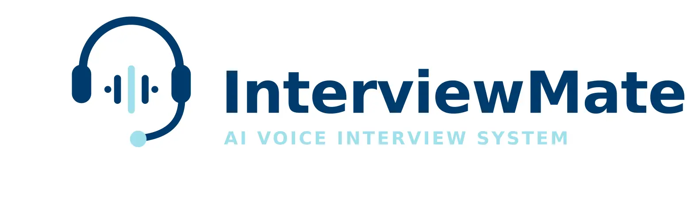

  

<h1 align="center">Interview Mate</h1>

  
  
  
  
  
  

  <em>« Le meilleur moment pour rater un entretien, c'est avant le vrai. »</em>
   — Interview Mate

---

## C'est quoi Interview Mate ?

**Interview Mate** est une application de **simulation d'entretien d'embauche assistée par IA**, en conditions réelles et en temps réel : le candidat parle à voix haute, un agent IA l'écoute, lui pose des questions, rebondit sur ses réponses, ajuste la difficulté et le clôture comme le ferait un vrai recruteur.

Concrètement, le candidat :
- choisit un **poste**, une **langue** et une **durée** d'entretien,
- **parle** dans son micro, comme dans un vrai entretien,
- **entend** les questions et relances de l'agent IA en voix synthétisée,
- reçoit à la fin un **retour structuré** sur sa prestation.

Tout se passe en flux continu (audio → texte → décision → voix), sans rupture, grâce à une architecture modulaire connectée en temps réel.

## Démo

  

## Les modules

Chaque module est indépendant, testable isolément, et documenté dans son propre README — clique sur une carte pour l'ouvrir.

## Architecture globale

> Chaque flèche entre le Gateway et un module correspond à une liaison **in-process** via un adapter qui implémente un port — voir le [README du Gateway](gateway/README.md) pour le détail.

---

  <b>Tu veux tester Interview Mate ?</b>

  

---

© Interview Mate — Tous droits réservés.
