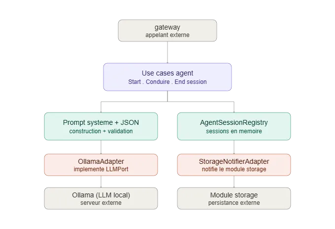

# Module `agent`

## Rôle

Le "cerveau" de l'entretien. À partir de l'état courant de la session
(phase, difficulté, historique des échanges), il construit le prompt
système envoyé au LLM, interprète sa réponse structurée (JSON) et en
déduit la question suivante à poser, le changement de phase, l'ajustement
de difficulté et la fin éventuelle de l'entretien.

## L'intelligence du LLM au cœur du module

Ce module ne contient quasiment aucune logique métier "en dur" : il
délègue au LLM la quasi-totalité des décisions de pilotage de
l'entretien, et se contente de lui fournir un contexte complet et de
valider/appliquer sa réponse. Concrètement, à chaque tour, le LLM reçoit
via `construire_prompt_systeme` :

- son persona ("CARLA", Lead Developer et Recruteuse Technique Senior),
  avec un ton et un comportement d'entretien réaliste imposés (pas de
  paraphrase, pas de faux compliments, rebond direct sur le contenu
  technique du candidat)
- l'état complet de l'entretien : phase actuelle, difficulté actuelle,
  quota de questions de la phase (posées/prévues), phase suivante
- l'historique intégral des échanges (questions + réponses)

Et c'est le LLM seul, pas de règle codée en Python, qui décide à chaque
tour :

- **la question suivante** à poser
- **la qualité perçue** de la réponse précédente (`faible`/`correcte`/`excellente`)
- **la difficulté suivante** à appliquer
- **si l'entretien change de phase** et vers laquelle
- **si le candidat a un comportement inapproprié**
- **si l'entretien est terminé**

Cette sortie est forcée en JSON structuré (`format=<schéma>` côté Ollama,
validé par `llm_json_client`), avec une seconde tentative automatique en
cas de JSON invalide. Le code Python ne fait donc qu'appliquer fidèlement
ce que le LLM décide — sauf sur un seul point où un garde-fou existe :
si le LLM répète une question déjà posée (ou renvoie une question vide),
le module renvoie une consigne corrective explicite et redemande une
question au LLM, plutôt que de trancher lui-même.

## Déroulement d'un entretien et intervention du module `agent`

1. **Démarrage** — le module `gateway` appelle
   `StartAgentSessionUseCase.executer(session_id, poste, langue, duree, difficulte)`.
   Le module crée l'entité `Interview`, construit le tout premier prompt
   système (historique vide, phase `intro`), interroge le LLM pour
   obtenir le message d'accueil + la première question, enregistre la
   session dans `AgentSessionRegistry` et renvoie ce message au `gateway`
   (qui le transmettra au candidat via le pipeline audio).

2. **Boucle de dialogue** — à chaque réponse orale du candidat
   (transcrite en amont par le module `asr`), le `gateway` appelle
   `ConduireEntretienUseCase.traiter_reponse_candidat(session_id, texte_reponse)` :
   - le module retrouve l'`Interview` en cours dans le registre et
     rattache la réponse au dernier échange ouvert ;
   - il reconstruit le prompt système avec l'historique à jour et
     interroge le LLM ;
   - il applique la qualité perçue et notifie le module `storage` via
     `StorageNotifierPort` (échange question/réponse persistant) ;
   - il met à jour la difficulté et, si besoin, la phase, à partir de la
     décision du LLM ;
   - si le LLM signale la fin de l'entretien, le module sauvegarde l'état
     final et renvoie `(", true)"` au `gateway` ;
   - sinon, il vérifie l'anti-répétition (relance corrective si besoin),
     enregistre la nouvelle question comme un nouvel échange, sauvegarde
     l'état et renvoie `(question, false)`.

3. **Fin de session** — le `gateway` (ou le module `scoring`) appelle
   `EndAgentSessionUseCase.executer(session_id)`, qui retire la session
   du registre et renvoie l'`Interview` complète (toutes les phases,
   difficultés et échanges) pour exploitation en aval (scoring, rapport).

Le module `agent` est donc l'unique point de passage entre "ce que dit le
candidat" et "ce que décide le LLM" : il ne fait ni STT, ni TTS, ni
scoring, ni persistance durable — il orchestre le dialogue et fait
confiance à l'intelligence du LLM pour le contenu et la stratégie de
l'entretien.

## Comportement du module

- **Stateful en mémoire** : l'état de toutes les sessions en cours vit
  dans `AgentSessionRegistry` (dictionnaire interne), pas de base de
  données côté `agent` — la persistance durable est déléguée au module
  `storage` via `StorageNotifierPort`.
- **Un appel LLM par tour** (deux en cas de répétition détectée) : chaque
  tour de dialogue correspond à un unique aller-retour avec le LLM en
  conditions normales.
- **Aucune règle de progression codée en dur** au-delà des quotas de
  questions par phase (définis par `DureeEntretien`) : c'est le LLM qui
  décide du contenu et du rythme réel dans ce cadre.
- **Tolérant aux imperfections du STT** : le prompt demande explicitement
  au LLM d'isoler le cœur du message et d'ignorer bruits/hachures de la
  transcription plutôt que de bloquer ou demander une reformulation.

## Schéma



## Architecture

Le module suit une architecture hexagonale (ports & adapters) :

- `domain/entities/` — objets métier : `Interview` (état complet d'une
  session), `Echange` (couple question/réponse/qualité), `Question`,
  `Reponse`
- `domain/value_objects/` — valeurs figées : `InterviewPhase`,
  `DifficultyLevel`, `DureeEntretien`, `Message`
- `domain/ports/` — contrats (interfaces) dont ce module a besoin de
  l'extérieur
- `domain/services/` — logique de construction du prompt système
  (`system_prompt_builder`) et d'appel LLM avec validation JSON
  (`llm_json_client`)
- `application/use_cases/` — orchestrent le domaine via les ports :
  `StartAgentSessionUseCase`, `ConduireEntretienUseCase`,
  `EndAgentSessionUseCase`
- `infrastructure/adapters/` — implémentations réelles : `OllamaAdapter`,
  `AgentSessionRegistry`, `StorageNotifierAdapter`

## Points d'entrée exposés

Ce module n'expose pas d'adapter dédié : le module `gateway` instancie et
appelle directement les trois use cases applicatifs, qui constituent le
contrat public du module :

- `StartAgentSessionUseCase.executer(session_id, poste, langue, duree, difficulte)`
- `ConduireEntretienUseCase.traiter_reponse_candidat(session_id, texte_reponse)`
- `EndAgentSessionUseCase.executer(session_id)`

## Ports requis (ce dont ce module a besoin des autres modules)

- `LLMPort` (`domain/ports/llm_port.py`) — génération de texte en
  streaming avec sortie JSON contrainte par schéma ; implémenté par
  `OllamaAdapter`
- `StorageNotifierPort` (`domain/ports/Storage_notifier_port.py`) —
  notification d'un échange terminé (question + réponse) ; implémenté
  par `StorageNotifierAdapter`, qui appelle directement
  `SaveLatestExchangeUseCase` du module `storage`

L'état de session (liste des `Interview` en cours) est géré en interne
par `AgentSessionRegistry`, un registre en mémoire — ce n'est pas une
dépendance externe.

## Utilisation en développement

```bash
python -m agent.dev_runner
```

Simulation interactive d'un entretien complet en CLI, avec affichage de
l'état interne (phase, difficulté, nombre d'échanges) à chaque tour.

## Adapters LLM disponibles

- `OllamaAdapter` — LLM local via Ollama, gratuit, nécessite Ollama
  installé et un modèle téléchargé. Configuré via variables
  d'environnement : `MODEL`, `NUM_PREDICT`, `KEEP_ALIVE`, `TEMPERATURE`.
  Utilise `format=<schéma JSON>` pour fiabiliser la sortie structurée et
  logue le débit de génération (tokens/s).

## Règles métier principales

- **Persona** : "CARLA", Lead Developer et Recruteuse Technique Senior,
  ton bienveillant mais exigeant, accueil en trois temps (bienvenue,
  cadrage, première question)
- **Phases** : `intro → presentation → competences → poste → cloture`,
  dans cet ordre strict, avec un nombre de questions par phase défini par
  `DureeEntretien` (`courte`, `moyenne`, `longue`)
- **Difficulté** : `facile` / `moyen` / `difficile`, réévaluée par le LLM
  à chaque tour
- **Anti-répétition** : consigne dans le prompt + filet de sécurité côté
  code (relance corrective si question vide ou déjà posée)
- **Comportement inapproprié** : détecté par le LLM, déclenche l'arrêt
  immédiat de l'entretien
- **Langue** : fixée à la création de la session, non modifiable en
  cours de route

## Statut

Développé et testé avec Ollama en conditions réelles (entretien
interactif complet, ajustement de difficulté, changement de phase et
anti-répétition vérifiés). `dev_runner.py` utilise les adapters réels du
module (`OllamaAdapter`, `AgentSessionRegistry`) et couvre tout le cycle
de vie d'une session (démarrage, boucle de dialogue, fin avec
récapitulatif) — il nécessite un serveur Ollama actif et un fichier `.env`
valide, mais aucune dépendance aux autres modules du projet.