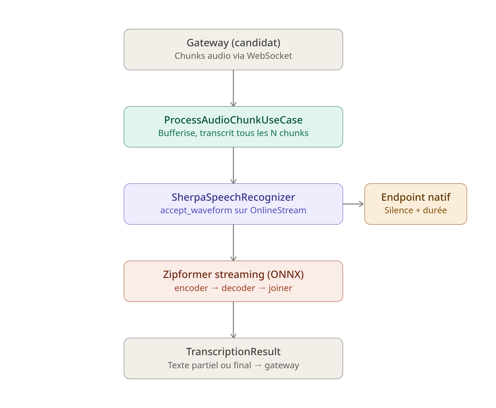

# Module `asr`

## Rôle

Les oreilles de l'intervieweur. Ce module transforme la voix du candidat,
reçue en streaming par le `gateway`, en texte exploitable par `agent`.

C'est le pendant symétrique du module `tts` : là où `tts` transforme le
texte de l'agent en voix, `asr` transforme la voix du candidat en texte.
Deux moteurs sont disponibles : **Sherpa-ONNX** (streaming, temps réel,
avec détection de fin de parole native) et **Whisper** (`faster-whisper`,
transcription par fenêtre, sans streaming natif).

## Schéma



## Déroulement d'une transcription

1. **Démarrage de session** — au lancement de l'entretien, le `gateway`
   appelle `StartASRSessionUseCase.executer(session_id, language)`. Une
   `ASRSession` est créée (buffer audio vide, compteur de chunks à 0) et
   stockée dans l'`ASRSessionRegistry`, en mémoire.

2. **À chaque chunk audio reçu du candidat** — `ProcessAudioChunkUseCase.executer(session_id,
   chunk)` est appelé. Le chunk est ajouté au buffer de la session
   (`ajouter_chunk`), qui **accumule tout l'audio depuis le début du
   tour de parole** (jamais vidé entre deux appels partiels). Pour ne
   pas relancer une transcription à chaque paquet reçu (coûteux), le
   use case ne déclenche `recognizer.transcrire_partiel(...)` que tous
   les `intervalle_chunks` chunks (5 par défaut) ; entre-temps, il
   renvoie un `TranscriptionResult` vide (`is_final=False, text=""`).

3. **Transcription partielle (Sherpa)** — `SherpaSpeechRecognizer.transcrire_partiel`
   reçoit le buffer **complet** accumulé depuis le début du tour, mais
   ne pousse dans le moteur que les **octets nouveaux** depuis le
   dernier appel (`_octets_deja_envoyes`, un delta par session) : le
   flux Sherpa est incrémental et pousser deux fois le même audio
   dupliquerait les features. Le delta est converti de PCM16 vers
   Float32 (`_pcm16_to_float32`), poussé dans l'`OnlineStream` de la
   session via `accept_waveform`, puis décodé tant que le moteur a
   assez de contexte (`is_ready` / `decode_stream`). `get_result` lit
   l'hypothèse courante **sans terminer le flux**, ce qui permet
   d'obtenir un texte partiel à tout moment sans perdre l'état interne.

4. **Détection de fin de parole** — `CheckEndpointUseCase.executer(session_id)`
   délègue à `recognizer.est_fin_de_parole_detectee(session_id)`. C'est
   un endpointing **natif** à Sherpa (basé sur des règles de silence en
   fin d'énoncé), utilisable par `gateway`/`agent` pour décider quand
   couper la parole au candidat sans attendre un signal explicite.

5. **Finalisation du tour** — quand le tour du candidat est terminé,
   `FinalizeTurnUseCase.executer(session_id)` appelle
   `recognizer.transcrire_final(...)` : le delta restant est poussé,
   puis `stream.input_finished()` signale au moteur qu'il n'y aura plus
   d'audio, ce qui vide le flux interne et produit le texte final
   complet du tour. Le flux Sherpa de la session est ensuite détruit
   (`_reinitialiser_flux`) — un `OnlineStream` ne survit pas à la fin
   d'un tour, contrairement à la session elle-même. Le buffer de
   l'`ASRSession` est également réinitialisé pour le tour suivant.

6. **Fin de session** — `EndASRSessionUseCase.executer(session_id)`
   supprime la session du registre en mémoire.

## Comment fonctionne Sherpa-ONNX ici

`SherpaSpeechRecognizer` s'appuie sur un **transducer streaming** (famille
RNN-T), servi via trois modèles ONNX distincts qui tournent ensemble à
chaque pas de décodage :

- **Encoder** — lit l'audio par petits blocs (features acoustiques) et
  produit une représentation contextuelle incrémentale ; c'est lui qui
  permet le streaming, car il n'a pas besoin d'attendre la phrase
  entière pour produire du contexte utile.
- **Decoder** (réseau de prédiction) — encode l'historique des tokens
  déjà émis, un peu comme un petit modèle de langage local.
- **Joiner** — combine la sortie de l'encoder et celle du decoder pour
  produire la distribution de probabilité du prochain token.

Ce triplet tourne dans un `OnlineRecognizer` (`sherpa_onnx.OnlineRecognizer.from_transducer`),
qui gère un `OnlineStream` par session : c'est cet objet qui porte
l'état interne du décodage (features en attente, contexte du decoder)
entre deux appels. C'est pourquoi l'adapter garde un dictionnaire
`_streams` par `session_id` plutôt que de recréer un flux à chaque appel
— recréer le flux perdrait tout le contexte déjà décodé.

La boucle `while self._recognizer.is_ready(stream): self._recognizer.decode_stream(stream)`
consomme autant de blocs que le moteur peut décoder avec l'audio déjà
reçu, puis s'arrête dès qu'il manque de contexte pour avancer — c'est
cette boucle qui donne le caractère « streaming » : elle peut être
appelée après chaque petit paquet audio sans jamais bloquer en
attendant la fin de la phrase.

L'endpointing (rules 1/2/3, voir plus bas) est une fonctionnalité native
de Sherpa, indépendante du décodage : elle observe le flux audio et
détecte les silences de fin d'énoncé selon des règles configurables,
sans dépendre d'un VAD externe.

## Variables de configuration de `SherpaSpeechRecognizer`

Toutes lues depuis l'environnement (`.env`, via `dotenv`) au constructeur
de l'adapter :

| Variable | Rôle |
|---|---|
| `TOKENS` | Chemin vers `tokens.txt` — la table de correspondance entre identifiants numériques et sous-mots/caractères utilisée par le decoder pour reconstruire du texte à partir des tokens prédits. |
| `ENCODER` | Chemin vers le fichier `.onnx` de l'encoder du transducer (voir ci-dessus). |
| `DECODER` | Chemin vers le fichier `.onnx` du decoder (réseau de prédiction). |
| `JOINER` | Chemin vers le fichier `.onnx` du joiner. |
| `NUM_THREADS` (déf. `4`) | Nombre de threads CPU utilisés par onnxruntime pour l'inférence — sans effet direct si `PROVIDER=cuda`. |
| `PROVIDER` (déf. `cuda`) | Backend d'exécution ONNX Runtime (`cuda` ou `cpu`). Le `dev_runner.py` force explicitement `cpu` pour les tests locaux sans GPU. |
| `SAMPLE_RATE` (déf. `16000`) | Fréquence d'échantillonnage attendue par le modèle — doit rester cohérente avec le reste du pipeline audio (16 kHz partout). |
| `FEATURE_DIM` (déf. `80`) | Dimension des features acoustiques (banque de filtres mel) extraites en interne par Sherpa avant l'encoder. |
| `DECODING_METHOD` (déf. `modified_beam_search`) | Stratégie de décodage : recherche en faisceau plutôt qu'un simple `greedy_search`, pour explorer plusieurs hypothèses de suite de tokens et retenir la plus probable. |
| `MAX_ACTIVE_PATHS` (déf. `4`) | Largeur du faisceau pour `modified_beam_search` — nombre d'hypothèses actives conservées à chaque pas. Plus élevé = plus précis mais plus lent. |
| `ENABLE_ENDPOINT_DETECTION` (déf. `true`) | Active l'endpointing natif de Sherpa, exposé ensuite via `est_fin_de_parole_detectee`. |
| `RULE1_MIN_TRAILING_SILENCE` (déf. `1.2` s) | Durée de silence en fin de flux déclenchant la règle 1 de fin d'énoncé (silence long, sans condition sur ce qui a été dit avant). |
| `RULE2_MIN_TRAILING_SILENCE` (déf. `0.6` s) | Durée de silence plus courte, utilisée en combinaison avec la règle 3 (silence après un énoncé déjà suffisamment long). |
| `RULE3_MIN_UTTERANCE_LENGTH` (déf. `100.0` — en frames) | Longueur minimale de l'énoncé décodé pour que la règle 2 s'applique — évite de couper la parole sur un tout petit silence après seulement quelques mots. |

Ces trois règles d'endpointing (`rule1`/`rule2`/`rule3`) sont celles de
Sherpa-ONNX : la 1 coupe sur un silence long peu importe le contexte, la
2+3 coupent plus tôt mais seulement si l'énoncé était déjà assez long —
un compromis entre réactivité et robustesse face aux courtes pauses en
milieu de phrase.

## Comportement du module

- **Sans état durable** : comme `tts`, ce module garde ses sessions
  uniquement en mémoire (`ASRSessionRegistry`) — aucune dépendance à
  `storage`. Le buffer audio et l'état du flux Sherpa sont perdus si le
  serveur redémarre en cours d'entretien.
- **Buffer cumulatif, envoi delta** : `ASRSession` accumule tout l'audio
  du tour en cours (utile pour Whisper, qui retranscrit sur une fenêtre
  glissante à partir du buffer complet) ; c'est l'adapter Sherpa, pas la
  session, qui se charge de ne pousser que les octets nouveaux dans le
  moteur streaming.
- **Deux moteurs interchangeables via `SpeechRecognizerPort`** :
  Sherpa (streaming natif, endpointing natif, CPU/GPU) et Whisper
  (fenêtré, deux tailles de modèle — un petit modèle rapide pour le
  partiel, un plus gros pour le final — sans endpointing natif).
- **Aucune logique de contenu** : ce module ne décide jamais quoi faire
  du texte transcrit, seulement comment produire ce texte à partir de
  l'audio — il ne connaît pas `agent`.

## Architecture

Le module suit une architecture hexagonale (ports & adapters) :

- `domain/entities/` — `ASRSession` (buffer audio + compteur de chunks
  d'une session)
- `domain/ports/` — `SpeechRecognizerPort` (contrat de transcription,
  partielle/finale, streaming ou non, + endpointing optionnel) et
  `ASRSessionRepositoryPort` (contrat de persistance de session, en
  mémoire)
- `application/use_cases/` — `StartASRSessionUseCase`,
  `ProcessAudioChunkUseCase`, `CheckEndpointUseCase`,
  `FinalizeTurnUseCase`, `EndASRSessionUseCase`
- `infrastructure/adapters/` — `SherpaSpeechRecognizer` (Sherpa-ONNX,
  streaming), `WhisperSpeechRecognizer` (`faster-whisper`, fenêtré) et
  `ASRSessionRegistry` (registre en mémoire, simple dictionnaire)

## Points d'entrée exposés

- `StartASRSessionUseCase.executer(session_id, language)`
- `ProcessAudioChunkUseCase.executer(session_id, chunk)` — retourne un
  `TranscriptionResult` partiel (souvent vide, throttlé)
- `CheckEndpointUseCase.executer(session_id)` — `bool`, fin de parole
  détectée ou non
- `FinalizeTurnUseCase.executer(session_id)` — `TranscriptionResult`
  final du tour
- `EndASRSessionUseCase.executer(session_id)`

## Ports requis (ce dont ce module a besoin de l'extérieur)

- **Sherpa-ONNX** (moteur ASR local) — fichiers `tokens.txt` +
  `encoder`/`decoder`/`joiner` `.onnx`, configurés via les variables
  d'environnement décrites plus haut, aucun appel réseau
- **Whisper** (via `faster-whisper`) — modèles téléchargés localement,
  choix du device (`cpu`/`cuda`) et du type de calcul (`int8`,
  `float16`, ...) passés explicitement au constructeur de l'adapter
- Aucune dépendance vers `storage`, `agent`, ou `tts` : ce module ne
  connaît que l'audio qu'on lui donne et la langue associée à la
  session

## Utilisation en développement

```bash
python -m asr.dev_runner
```

Capture le micro en direct (`sounddevice`), transcrit en streaming avec
`SherpaSpeechRecognizer` et affiche les résultats partiels en continu
dans le terminal, puis le résultat final à l'arrêt (`Ctrl+C`) — utile
pour vérifier rapidement qu'un jeu de modèles Sherpa se charge et
transcrit correctement, indépendamment du reste du pipeline (gateway,
WebSocket, frontend).

`test_voix.py` est un second script de test, orienté Whisper : il
enregistre des extraits de 10 secondes à la demande et affiche le texte
et la confiance retournés par `WhisperSpeechRecognizer`.

## Adapters disponibles

- `SherpaSpeechRecognizer` — streaming natif, endpointing natif, un seul
  flux persistant par session, rééchantillonnage non nécessaire (audio
  déjà à 16 kHz côté gateway)
- `WhisperSpeechRecognizer` — deux modèles chargés (partiel rapide,
  final plus précis), fenêtre glissante tronquée
  (`fenetre_max_secondes`), pas de flux persistant ni d'endpointing
  natif

## Règles métier principales

- **La langue est fixée à la création de la session**, non modifiable en
  cours d'entretien — cohérent avec `agent` et `tts`.
- **Le format audio d'entrée est toujours du PCM16 à 16 kHz**, converti
  en Float32 avant d'être transmis au moteur, quel que soit l'adapter
  utilisé.
- **Le buffer d'une `ASRSession` est réinitialisé à chaque fin de
  tour** (`FinalizeTurnUseCase`), pas à chaque transcription partielle
  — un tour de parole correspond à un seul buffer, du premier chunk
  jusqu'à la finalisation.
- **Aucune logique de contenu** : ce module ne décide jamais quoi faire
  du texte transcrit, seulement comment le produire.

## Points à vérifier

- **Pas de `composition_root.py`** pour ce module, contrairement à
  `tts` qui en a un (`TTSContainer`). Le câblage des cinq use cases
  avec leurs adapters (`SherpaSpeechRecognizer` ou
  `WhisperSpeechRecognizer` + `ASRSessionRegistry`) est donc forcément
  fait ailleurs (probablement `server.py`), sans point d'assemblage
  centralisé propre au module — à harmoniser avec le pattern déjà en
  place côté `tts` si la cohérence entre modules est recherchée.
- **`WhisperSpeechRecognizer` n'implémente pas `est_fin_de_parole_detectee`
  ni `fermer_session`**, alors que `SpeechRecognizerPort` les déclare
  (même en `Protocol`, donc non forcés à l'exécution). Si le `gateway`
  appelle `CheckEndpointUseCase` sans vérifier quel moteur est
  actuellement branché, un déploiement en mode Whisper lèvera une
  `AttributeError` à l'exécution plutôt qu'un simple `False`.
- **La structure décrite dans la section « Structure » de ce même
  README (`application/ports/`) ne correspond pas à l'arborescence
  réelle** (`domain/ports/`) — à corriger pour éviter la confusion pour
  quelqu'un qui chercherait les ports au mauvais endroit.
- `dev_runner.py` construit `SherpaSpeechRecognizer` avec des arguments
  positionnés (`tokens_path=...`, `encoder_path=...`, etc.) puis
  retombe sur un `except TypeError` vers `SherpaSpeechRecognizer()`
  sans arguments — mais l'implémentation actuelle de l'adapter ne prend
  justement aucun argument au constructeur et lit tout depuis
  `os.environ` (`TOKENS`, `ENCODER`, ...) : le premier essai échoue
  systématiquement, ce n'est que le `except` qui fonctionne. Le
  `dev_runner` est donc correct à l'usage mais son premier bloc
  `try` est mort code, à nettoyer.
- **Deux modèles Whisper chargés simultanément en mémoire** (un pour le
  partiel, un pour le final) — potentiellement coûteux en VRAM/RAM
  selon les tailles choisies ; aucun mécanisme de déchargement ou de
  partage de modèle contrairement au cache de voix de `tts`
  (`_voix_chargees`).

## Statut

Le flux complet a été validé avec le vrai moteur Sherpa-ONNX en
streaming micro (`dev_runner.py`) : chargement des modèles, transcription
partielle en continu, finalisation du tour. Le chemin Whisper a été
testé isolément via `test_voix.py`. Les points relevés ci-dessus sont
des améliorations de cohérence, pas des bugs bloquants connus.
