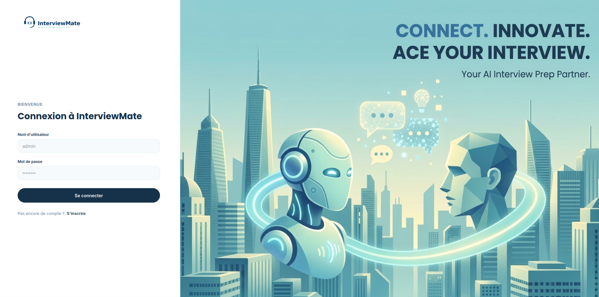
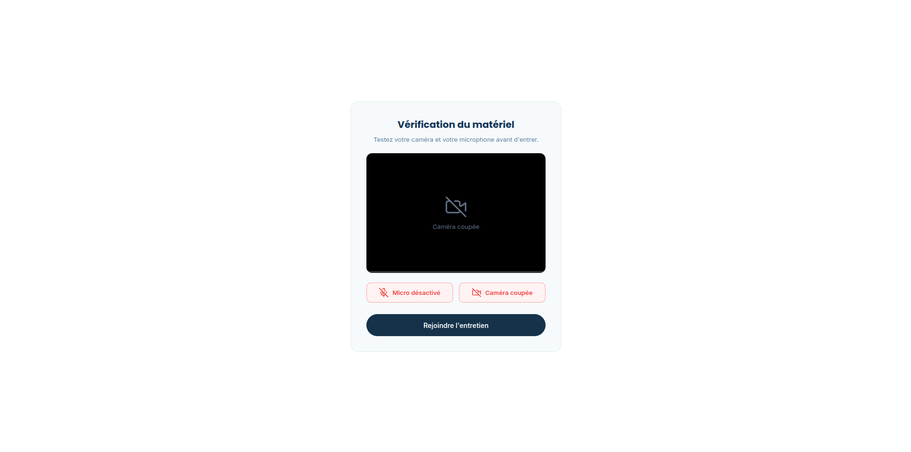
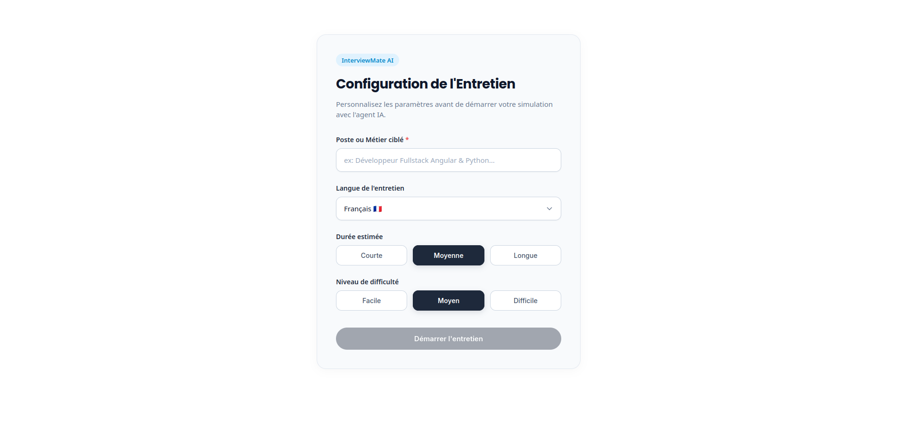
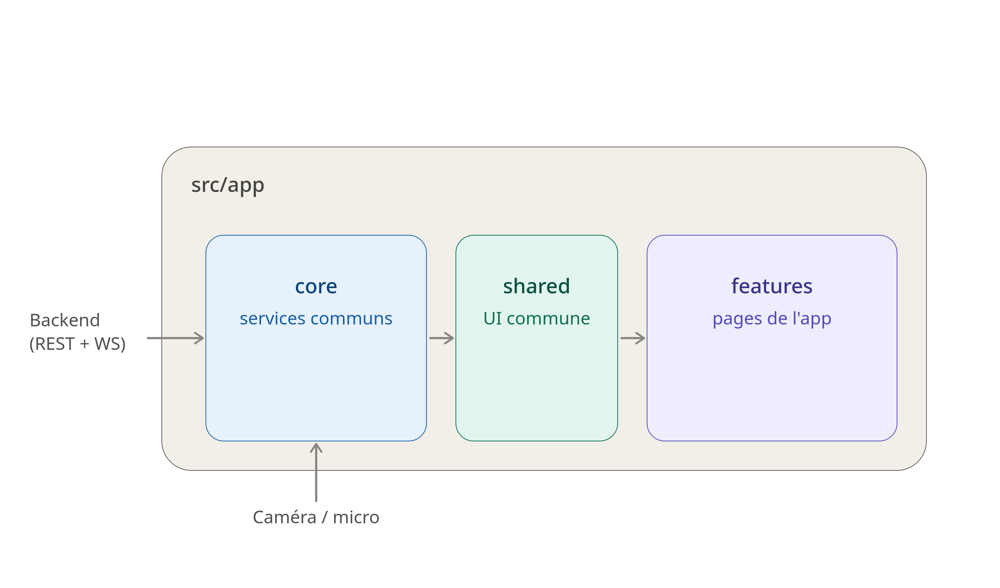

<div align="center">

# 🎙️ InterviewMate — Frontend

**Simulateur d'entretiens d'embauche assisté par IA, en temps réel.**


</div>

---

## ✨ À propos

**InterviewMate** est une application Angular qui simule des entretiens d'embauche face à un agent IA, avec **audio et vidéo en temps réel** (WebSocket), transcription en direct, et génération d'un rapport de fin d'entretien.

L'utilisateur configure son entretien (poste, langue, durée, difficulté), effectue un test caméra/micro, puis échange en direct avec l'agent avant de recevoir une synthèse de sa performance.

---

## 📸 Aperçu de l'application


| Connexion | Configuration de l'entretien |
|:---:|:---:|
|  |  |


| Vérification matériel (Pre-call) | Salle d'entretien (live) |
|:---:|:---:|
|  |  |

| Fin d'entretien | Rapport & Historique |
|:---:|:---:|
|  |  |

---

## 🏗️ Architecture

Architecture en couches typique Angular : **pages (features)** → **services coeur (core/)** → **composants partagés (shared/)**, avec deux canaux de communication backend : **WebSocket** pour le flux d'entretien en temps réel, et **REST** pour l'authentification et l'historique.



**Points clés :**
- 🔌 **`core/gateway`** — gère la connexion WebSocket avec l'agent IA (init de session, reconnexion, messages entrants/sortants, codes de fermeture).
- 🎥 **`core/media`** — encapsule `getUserMedia` pour le flux audio/vidéo (micro, caméra, activation/désactivation des pistes).
- 🔐 **`core/auth`** — gestion de l'état d'authentification via `signal`, guard de routes et interceptor HTTP.
- 🌐 **`core/api`** — appels REST vers le backend (historique des entretiens, échanges).
- 🧱 **`shared/ui`** — bibliothèque de composants réutilisables (avatar, badges de statut, boutons de contrôle d'appel, modales).
- 🗂️ **`interview-room.store.ts`** — état local de la salle d'entretien (phase, transcription, statut de connexion) piloté par signals Angular.

---

## 🧭 Parcours utilisateur

```
Connexion / Inscription
        │
        ▼
     Accueil ──── Historique des entretiens
        │
        ▼
Configuration (poste, langue, durée, difficulté)
        │
        ▼
Pre-call (test micro / caméra)
        │
        ▼
Salle d'entretien (WebSocket temps réel + IA)
        │
        ▼
Fin d'entretien ──── Rapport détaillé
```

---

## 📁 Structure du projet

```
src/app/
├── core/                     # Services transverses (singletons)
│   ├── api/                  # Client REST (historique, échanges)
│   ├── auth/                 # Auth service, guard, interceptor
│   ├── gateway/               # Client WebSocket temps réel
│   ├── layout/                # App Shell (layout principal)
│   └── media/                  # Gestion micro / caméra
├── features/                  # Pages de l'application (lazy-loaded)
│   ├── auth/                   # Login / Register
│   ├── home/                    # Accueil
│   ├── interview-setup/         # Configuration de l'entretien
│   ├── pre-call/                 # Vérification du matériel
│   ├── interview-room/            # Salle d'entretien (live)
│   ├── interview-end/              # Fin d'entretien
│   ├── interview-report/            # Rapport de performance
│   └── interview-history/            # Historique des entretiens
└── shared/ui/                  # Composants UI réutilisables
```

---

## 🚀 Démarrage rapide

### Prérequis

- Node.js (LTS recommandé)
- npm `11.11.0` ou supérieur

### Installation

```bash
npm install
```

### Lancer en développement

```bash
npm start
```

L'application est servie sur `http://localhost:4200/`.

### Build de production

```bash
npm run build
```

### Lancer les tests

```bash
npm test
```

---

## 🛣️ Routes principales

| Route | Description |
|---|---|
| `/` | Connexion |
| `/register` | Inscription |
| `/home` | Accueil |
| `/home/history` | Historique des entretiens |
| `/setup` | Configuration de l'entretien |
| `/pre-call` | Vérification du matériel |
| `/interview` | Salle d'entretien (protégée par un guard de sortie) |
| `/interview/end` | Fin d'entretien |

---

## 🛠️ Stack technique

- **Angular 21** — Standalone Components, Signals, lazy loading
- **RxJS** — flux réactifs et gestion des WebSockets
- **TypeScript 5.9**
- **Vitest** — tests unitaires
- **Prettier** — formatage du code

---

## 📄 Licence

Projet interne — à adapter selon vos besoins.