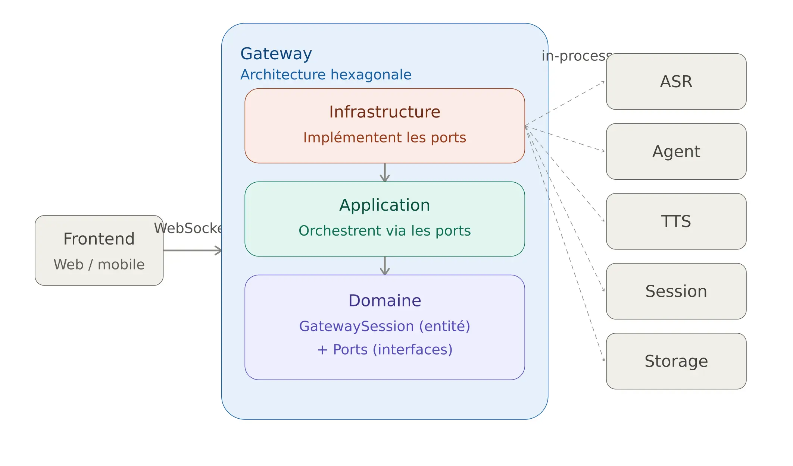
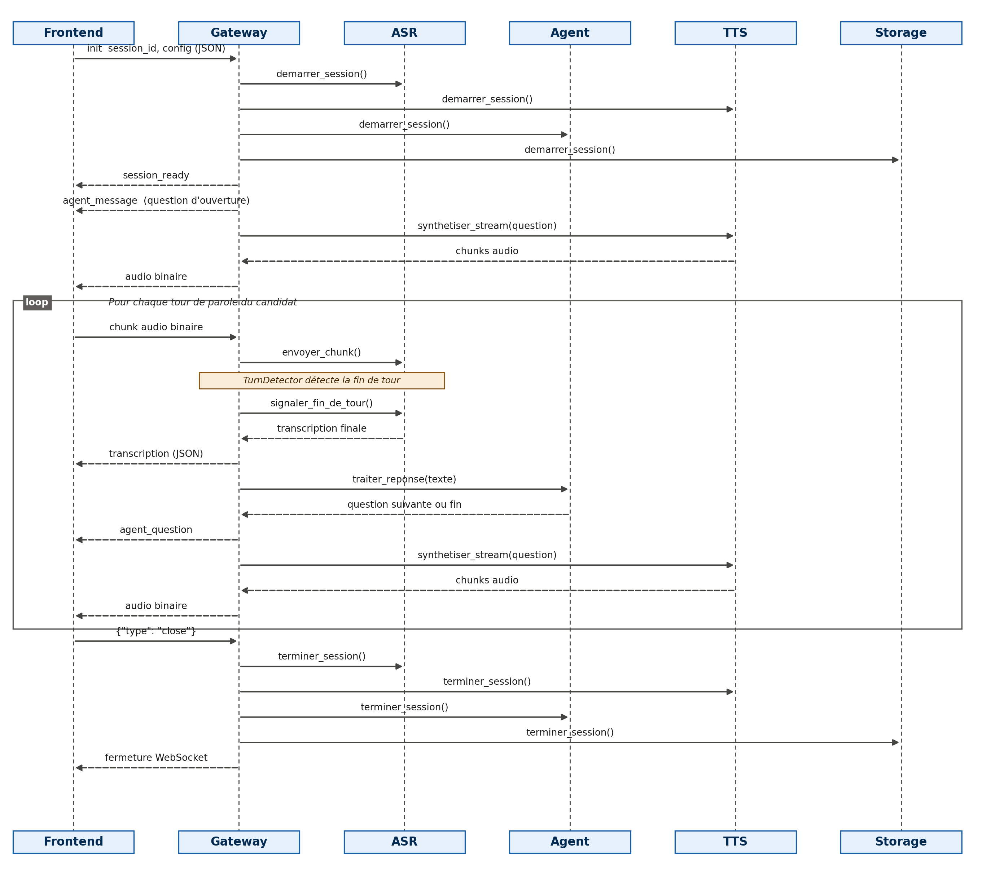

# Module `gateway`

## 1. Rôle

Le `gateway` est le **point d'entrée unique** de l'application côté temps réel. C'est lui qui :

- accepte les connexions **WebSocket** venant du frontend (web / mobile),
- gère le cycle de vie d'une session d'entretien (démarrage, coupure, reconnexion, fermeture),
- reçoit le flux audio du candidat et le fait transiter vers l'**ASR**,
- transmet le texte transcrit à l'**Agent** pour obtenir la question/relance suivante,
- fait synthétiser cette réponse par le **TTS** et la renvoie en audio au frontend,
- notifie le **Storage** du début/fin de session.

Il ne contient **aucune logique métier** propre à l'entretien (pas de scoring, pas de génération de questions) : c'est un pur **orchestrateur / routeur temps réel** entre le frontend et les modules internes.

## 2. Comment ce module relie tous les autres modules et comment il est lié au frontend

- **Frontend ↔ Gateway** : liaison unique via **WebSocket** (`gateway/infrastructure/adapters/websocket_gateway_adapter.py`, classe `WebSocketConnectionHandler`). Le frontend n'appelle jamais directement ASR/Agent/TTS/Storage : tout passe par ce socket.
- **Gateway → Autres modules (ASR, Agent, TTS, Session, Storage)** : liaison **in-process** (appel de fonction directe, même processus Python, pas de réseau). Chaque module cible est atteint via un **adapter dédié** qui implémente un **port** du domaine `gateway` (voir section 5).
- L'assemblage de toutes ces briques se fait dans `gateway/server.py` (`ApplicationContainer`), qui joue le rôle de **composition root** : il instancie chaque module, ses use cases, puis les adapters `InProcess*Client` qui les exposent au Gateway.

## 3. Comment il transfère l'audio entre les modules

Le Gateway ne fait **aucun traitement audio lui-même** (pas de décodage, pas de VAD complexe) : il **relaie** des `AudioChunk` d'un module à l'autre.

- **Candidat → ASR** : chaque message binaire reçu sur le WebSocket devient un `AudioChunk` (avec numéro de séquence) et est transmis à `ASRClientPort.envoyer_chunk()`. Un `TurnDetectorPort` (implémenté par `SherpaTurnDetectorAdapter`) analyse en parallèle si le tour de parole est terminé.
- **Agent → TTS → Candidat** : une fois la question de l'agent obtenue, `RequestVoiceResponseUseCase` appelle `TTSClientPort.synthetiser_stream()`, qui **stream** des `AudioChunk` de synthèse. Chaque chunk est immédiatement renvoyé au frontend via `AudioBroadcasterPort.envoyer_audio_candidat()` (implémenté par `WebSocketConnectionHandler` lui-même, qui écrit sur le socket).

L'audio ne transite donc jamais par le Storage ni par l'Agent : seuls le texte (transcription, question) et les métadonnées de session le font.

## Comportement du module

- Une session démarre uniquement après un message d'initialisation JSON valide (`session_id`, `config`) — sinon la connexion est fermée (`code 4000`).
- La session est représentée par l'entité `GatewaySession`, avec deux états : `connection_state` (CONNECTING, ACTIVE, DISCONNECTED, RECONNECTING, CLOSED) et `turn_state` (SILENT, SPEAKING, TURN_ENDED).
- Toute action sur une session non active lève `SessionNonActiveError` ; une reconnexion sur une session fermée lève `SessionFermeeError`.
- La reconnexion est supportée : le client renvoie `{"reconnect": true, "session_id": ...}` et retrouve sa session existante via le `SessionRegistry` interne au Gateway.
- Une coupure réseau (`ConnectionClosed`) déclenche `SignalDisconnectionUseCase` plutôt qu'une fermeture immédiate, pour permettre une reconnexion.

## Schémas

### Architecture du module (hexagonale)



### Pipeline d'un échange (audio → texte → réponse → audio)



## Architecture (structure des dossiers)

```
gateway/
├── domain/
│   ├── entities/          # GatewaySession (états connexion + tour de parole)
│   ├── value_objects/     # ConnectionState, TurnState
│   ├── exceptions/        # GatewayException et dérivées
│   └── ports/             # Contrats abstraits (ASR, TTS, Agent, Session, Storage, Broadcaster, TurnDetector)
├── application/
│   └── use_cases/         # StartSession, ReceiveAudioChunk, RequestVoiceResponse,
│                           # HandleTranscriptionResult, SignalDisconnection,
│                           # RequestReconnection, CloseSession
├── infrastructure/
│   └── adapters/           # WebSocketConnectionHandler, InProcess*Client,
│                            # SessionRegistry, SherpaTurnDetectorAdapter
├── server.py               # Composition root (ApplicationContainer) + serveur WebSocket
└── dev_runner.py           # Point d'entrée pour tester ce module isolément
```

## Points d'entrée exposés

Le Gateway est le seul module exposé **au monde extérieur** :

- **Serveur WebSocket** (`ws://host:port`, démarré dans `server.py::main`).
- Messages entrants acceptés :
  - JSON d'initialisation : `{"session_id": ..., "config": {"poste", "langue", "duree", "difficulte"}}` ou `{"reconnect": true, "session_id": ...}`
  - Chunks audio bruts (binaire)
  - Message de contrôle : `{"type": "close"}`
- Messages sortants envoyés au frontend : `session_ready`, `reconnected`, `agent_message`, `agent_question`, `transcription`, puis des chunks audio binaires (TTS).

En interne, il n'expose **aucun port** aux autres modules (aucun module n'appelle le Gateway) — il ne fait qu'appeler.

## Comment les autres modules sont liés via un adapter

Pour chaque module externe, le Gateway définit un **port** (interface abstraite dans `domain/ports/`) et une **implémentation in-process** dans `infrastructure/adapters/` :

| Port (domaine gateway) | Adapter concret | Module ciblé |
|---|---|---|
| `AgentClientPort` | `InProcessAgentClient` | `agent` (via `StartAgentSessionUseCase`, `ConduireEntretienUseCase`, `EndAgentSessionUseCase`) |
| `ASRClientPort` | `InProcessASRClient` | `asr` |
| `TTSClientPort` | `InProcessTTSClient` | `tts` |
| `SessionClientPort` | `InProcessSessionClient` | `session` |
| `StorageClientPort` | `InProcessStorageClient` | `storage` |

Chaque adapter ne fait qu'**appeler directement les use cases du module cible** (aucun protocole réseau) : c'est un simple objet qui traduit le langage du Gateway (`demarrer_session`, `traiter_reponse`, `terminer_session`, ...) vers les use cases propres à chaque module. Cela permet de remplacer demain un adapter in-process par un adapter réseau (gRPC/HTTP/queue) sans toucher au domaine ni aux use cases du Gateway.

## Statut

- Pipeline fonctionnel de bout en bout : démarrage de session, réception audio, détection de fin de tour, transcription, relance de l'agent, synthèse vocale, reconnexion, fermeture propre.
- Tous les modules sont actuellement liés en **in-process** (même processus Python) — pas encore de déploiement distribué/réseau entre modules.
- Aucun test automatisé n'a été trouvé dans l'archive fournie.
- Le fichier `README.md` d'origine du module contenait encore des sections `TODO` (rôle, ports exposés/requis) — complétées ici à partir de la lecture du code.