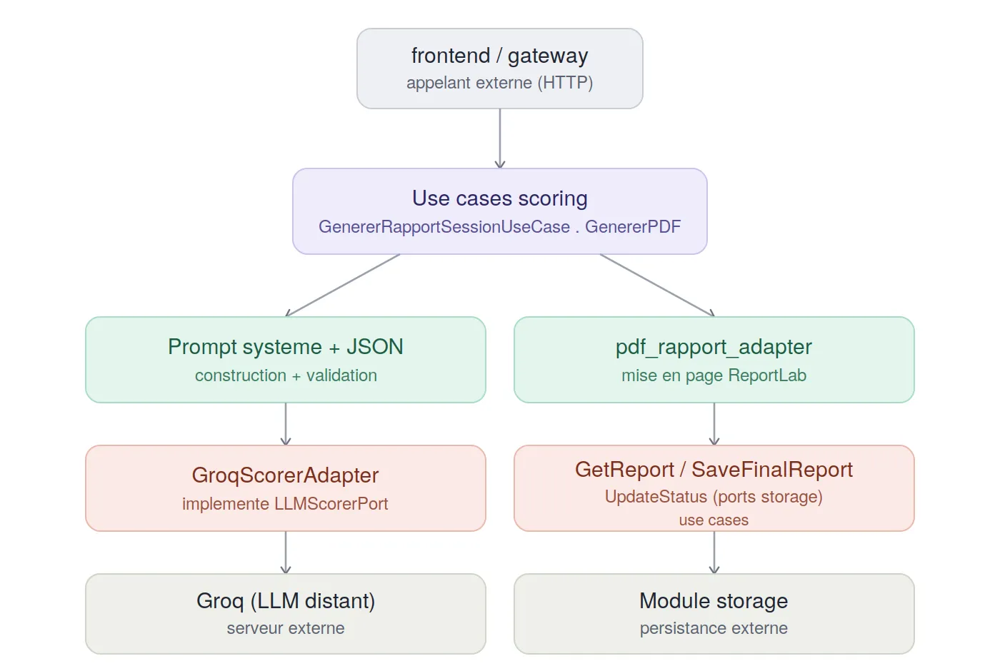

# Module `scoring`

## Rôle

L'évaluateur de fin d'entretien. À partir du transcript complet d'une
session (questions posées par l'agent, réponses du candidat, qualité
perçue en direct par le module `agent`), il produit un rapport de
notation structuré : score global, score technique, score communication,
points forts, points faibles, recommandations actionnables, et le détail
échange par échange. Il expose aussi la génération de ce rapport au
format PDF, sans emoji, prêt à être partagé avec le candidat ou le
recruteur.

## L'évaluation déléguée au LLM

Comme pour le module `agent`, ce module ne code aucune grille de
notation "en dur" : il délègue au LLM (Groq) la quasi-totalité du
jugement, et se contente de lui fournir le transcript complet et de
valider/persister sa réponse structurée. Le prompt système
(`prompt_systeme_scoring.txt`) impose au LLM :

- une **échelle de notation stricte de 0 à 10**, avec cinq bandes
  définies (insuffisant, faible, correct, bon, excellent) et une
  description précise de chaque bande
- une **méthode de pondération explicite**, pour éviter une simple
  moyenne arithmétique : progression au fil de l'entretien, profondeur
  technique pondérée par la difficulté de la question, cohérence globale
  du discours, et communication évaluée indépendamment du contenu
  technique (`score_communication` distinct de `score_technique`)
- des **consignes de rédaction anti-vague** : chaque remarque et chaque
  point fort/faible doit s'appuyer sur un élément concret du transcript
  (citer la question ou la réponse concernée), jamais une formule
  générique non justifiée ; si le transcript est trop pauvre pour juger
  un critère, le LLM doit le dire explicitement plutôt que d'inventer une
  appréciation
- des **recommandations actionnables**, jamais vagues

Cette sortie est forcée en JSON structuré côté Groq
(`response_format={"type": "json_object"}`), avec un schéma exact
(score_global, score_technique, score_communication, points_forts,
points_faibles, recommandations, evaluations — une entrée par tour avec
ordre, question, réponse, qualité perçue, score technique et remarque).
Le code Python ne fait qu'appliquer fidèlement cette réponse : aucune
règle de calcul de score n'existe côté application.

## Déroulement d'une génération de rapport

1. **Déclenchement** — le rapport est généré à la demande, via
   `GET /scoring/{session_id}` (JSON) ou `GET /scoring/{session_id}/pdf`
   (fichier PDF téléchargeable), exposés par `scoring_router`. Le module
   `gateway` (ou le frontend directement) appelle cet endpoint à la
   clôture de l'entretien.

2. **Génération (`GenererRapportSessionUseCase`)** — le module récupère
   le transcript persisté de la session via
   `GetSessionTranscriptUseCase` (module `storage`). Si aucun échange
   n'a été enregistré, un rapport neutre à zéro est renvoyé directement,
   sans appel LLM. Sinon, les échanges sont mis en forme (ordre,
   question, réponse, qualité perçue en direct) et transmis à
   `LLMScorerPort.generer_rapport(...)`, qui interroge Groq et retourne
   un `RapportScore` du domaine.

3. **Persistance (get-or-generate)** — le rapport produit est aussitôt
   sauvegardé via `SaveFinalReportUseCase` (module `storage`), et le
   statut de la session est mis à jour avec le score obtenu
   (`UpdateStatusUseCase`, format `"{score}/10"`). Un appel ultérieur au
   même endpoint doit passer par `GetReportUseCase` pour lire le rapport
   déjà persisté plutôt que de renotifier Groq — c'est ce pattern
   "get-or-generate" qui évite un second appel LLM coûteux et non
   déterministe pour la même session.

4. **Export PDF (`GenererPDF` + `generer_pdf_rapport`)** — à la demande,
   le rapport déjà persisté est relu (`GetReportUseCase`), reconverti en
   entité domaine `RapportScore`, puis mis en page dans un PDF
   professionnel (ReportLab) : synthèse des trois scores en tableau
   d'en-tête, sections points forts / points à améliorer /
   recommandations en listes à puces, et tableau détaillé de tous les
   échanges (ordre, question, réponse, qualité, score, remarque). Le
   fichier est écrit dans `scoring/pdf/` puis renvoyé en téléchargement
   via `FileResponse`.

## Comportement du module

- **Sans état propre** : contrairement à `agent` ou `asr`, ce module ne
  maintient aucun registre de session en mémoire — chaque appel est
  autonome et s'appuie entièrement sur ce qui est déjà persisté côté
  `storage`.
- **Un seul appel LLM par rapport**, jamais recalculé automatiquement :
  la persistance immédiate du rapport (étape 3) sert de cache — un
  rapport déjà généré n'est jamais régénéré à l'identique par une
  requête ultérieure sur le même `session_id`.
- **Dégradation propre en l'absence d'échanges** : une session sans
  aucun tour de dialogue produit un rapport à zéro (scores à 0, listes
  vides) plutôt qu'une erreur — utile pour les sessions interrompues très
  tôt.
- **Format de sortie strict** : le contrat JSON du LLM (`RapportScore`,
  `EvaluationEchange`) est identique entre le rapport JSON de l'API et le
  rapport PDF, garantissant que les deux vues restent toujours
  cohérentes entre elles.

## Schéma



## Architecture

Le module suit une architecture hexagonale (ports & adapters) :

- `domain/entities/` — `RapportScore` (rapport complet d'une session) et
  `EvaluationEchange` (notation d'un tour individuel : question, réponse,
  qualité perçue, score technique, remarque)
- `domain/ports/` — contrats dont ce module a besoin de l'extérieur :
  `LLMScorerPort` (génération du rapport par un LLM) et `GenererPDF`
  (génération d'un export PDF à partir d'un rapport déjà persisté)
- `application/use_cases/` — orchestrent le domaine via les ports :
  `GenererRapportSessionUseCase` (génère et persiste le rapport),
  `GenererPDF` (relit un rapport persisté et le convertit en entité
  domaine pour l'export)
- `infrastructure/adapters/` — implémentations réelles :
  `GroqScorerAdapter` (LLM via l'API Groq), `pdf_rapport_adapter`
  (mise en page PDF via ReportLab, sans emoji)
- `infrastructure/prompts/` — `prompt_systeme_scoring.txt`, le prompt
  système versionné séparément du code
- `api/` — `scoring_router.py`, le seul module du projet à exposer
  directement des routes HTTP (FastAPI) plutôt que de simples use cases
  appelés en interne par le `gateway`

## Points d'entrée exposés

Contrairement à `agent`, ce module expose un **routeur HTTP** dédié
(`scoring_router`), monté avec le préfixe `/scoring` :

- `GET /scoring/{session_id}` — génère (ou régénère si le cache est
  vide) le rapport de notation et le renvoie en JSON
- `GET /scoring/{session_id}/pdf` — renvoie le rapport au format PDF en
  téléchargement (génère le rapport JSON sous-jacent au préalable si
  besoin)

## Ports requis (ce dont ce module a besoin des autres modules)

- `LLMScorerPort` (`domain/ports/llm_scorer_port.py`) — génération d'un
  rapport structuré à partir d'une liste d'échanges ; implémenté par
  `GroqScorerAdapter`
- `GenererPDF` (`domain/ports/generer_pdf.py`) — génération d'un export
  PDF à partir d'un `session_id` ; contrat abstrait, la mise en page
  réelle vit dans `pdf_rapport_adapter.generer_pdf_rapport`
- Dépendances directes vers le module `storage` :
  `GetSessionTranscriptUseCase` (lecture du transcript),
  `SaveFinalReportUseCase` (persistance du rapport),
  `UpdateStatusUseCase` (mise à jour du statut de session), et
  `GetReportUseCase` (lecture d'un rapport déjà persisté, pour l'export
  PDF et pour le pattern get-or-generate)

Ce module ne gère aucun état de session en interne : toute la mémoire
utile (transcript, rapport, statut) est déléguée au module `storage`.

## Utilisation en développement

```bash
python -m scoring.dev_runner
```

Génère un rapport pour une session déjà peuplée
(`session_dev_test`, via `storage.dev_runner`) sans appeler l'API Groq
réelle, afin de tester le câblage du use case indépendamment du coût et
de la non-déterminisme d'un vrai appel LLM.

> **Note** : `dev_runner.py` référence actuellement
> `scoring.infrastructure.fakes.fake_llm_scorer_adapter`
> (`FakeLLMScorerAdapter`), qui n'existe pas encore dans
> `infrastructure/adapters/` — ce dossier `fakes/` reste à créer avant
> que ce point d'entrée soit exécutable tel quel. Le script suppose
> aussi une signature de `GenererRapportSessionUseCase` avec
> `get_report_uc`, alors que le use case réel attend `update_status_uc` à
> la place — à aligner en même temps.

## Adapters LLM disponibles

- `GroqScorerAdapter` — LLM distant via l'API Groq, modèle configuré par
  `GROQ_MODEL` (actuellement `openai/gpt-oss-120b`), authentifié par
  `GROQ_API_KEY`. Force une sortie JSON stricte
  (`response_format={"type": "json_object"}`), sans étape de validation
  applicative supplémentaire au-delà du `json.loads`.

> **Note** : le prompt système utilisé par `GroqScorerAdapter` est
> actuellement codé en dur dans l'adapter (`PROMPT_SYSTEME`), en
> doublon exact du fichier externe `prompt_systeme_scoring.txt` (dont le
> chemin est pourtant défini dans `.env` via
> `PROMPT_SYSTEME_SCORING_PATH`). L'adapter ne lit pas ce fichier — les
> deux copies peuvent diverger silencieusement si l'une est modifiée sans
> l'autre.

## Règles métier principales

- **Échelle de notation** : 0 à 10, cinq bandes fixes (insuffisant,
  faible, correct, bon, excellent), identiques pour `score_global`,
  `score_technique`, `score_communication` et le score de chaque
  évaluation individuelle
- **Pondération non arithmétique** : progression au fil de l'entretien,
  profondeur technique pondérée par la difficulté, cohérence globale,
  communication évaluée séparément du contenu technique
- **Traçabilité obligatoire** : chaque point fort, point faible et
  remarque doit être justifié par un élément concret du transcript
- **Vocabulaire fermé pour `qualite_percue`** (au niveau de chaque
  évaluation) : `insuffisante`, `vague`, `correcte`, `bonne`,
  `excellente`
- **Recommandations actionnables**, jamais génériques
- **Rapport neutre si transcript vide** : score à 0 sur toutes les
  dimensions, aucune invention de contenu
- **Cache de génération** : un rapport une fois généré et persisté n'est
  pas recalculé à chaque consultation

## Statut

Le flux complet a été validé de bout en bout : génération du rapport via
Groq, persistance en base (`rapports_scoring`, colonne `evaluations` en
JSONB), relecture via `GET /scoring/{session_id}`, et export PDF
professionnel sans emoji via `GET /scoring/{session_id}/pdf`. Le point
d'entrée `dev_runner.py` nécessite encore la création du
`FakeLLMScorerAdapter` (voir section *Utilisation en développement*)
pour être exécutable isolément sans dépendre de l'API Groq.