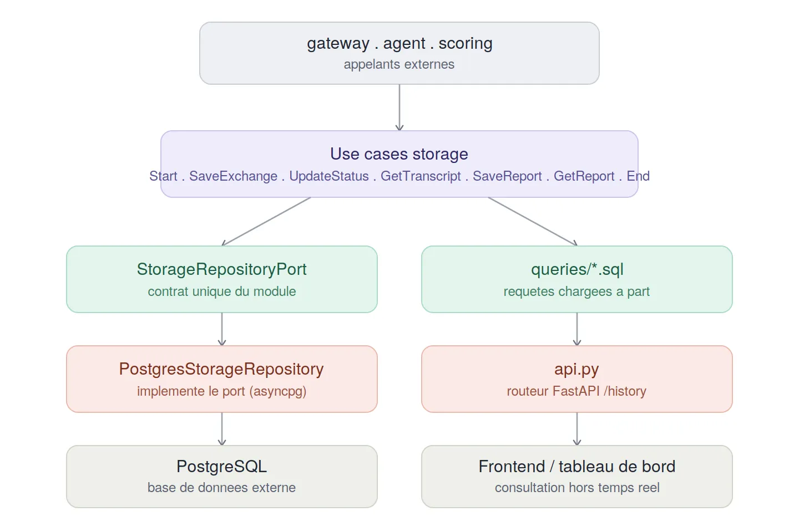
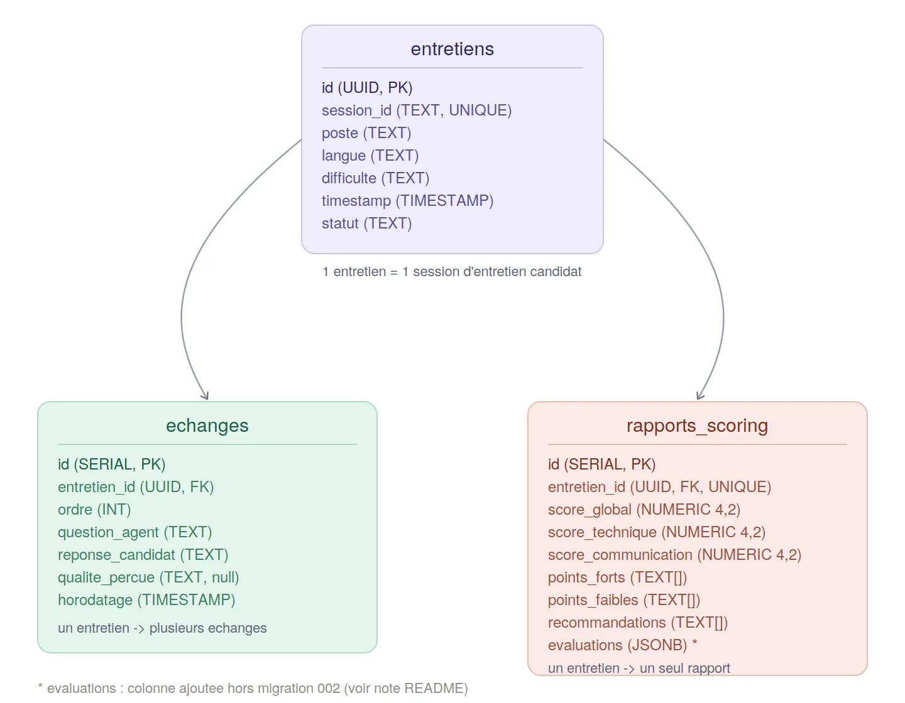

# Module `storage`

## Rôle

La mémoire durable du projet. Ce module persiste tout ce qui doit
survivre au-delà d'une session en mémoire (`agent`, `asr`, `gateway`) :
la création d'un entretien, chaque échange question/réponse au fil du
dialogue, le statut de la session, et le rapport de notation final. Il
expose aussi une lecture en lot de l'historique des entretiens
(`api/api.py`) pour un usage hors pipeline temps réel (tableau de bord,
historique candidat, etc.).

Contrairement à `agent` ou `scoring`, ce module ne contient aucune
intelligence ni règle métier complexe : c'est une couche de persistance
pure, qui traduit des entités du domaine en lignes PostgreSQL et
inversement.

## Schéma



## Déroulement d'usage type

1. **Démarrage d'un entretien** — le `gateway` appelle
   `StartStorageSessionUseCase.executer(session_id, poste, langue,
   difficulte, timestamp)`, qui insère une ligne dans `entretiens`. La
   requête utilise `ON CONFLICT (session_id) DO NOTHING` : un appel en
   double sur le même `session_id` (ex: reconnexion) ne casse rien et
   n'écrase rien.

2. **Chaque tour de dialogue** — le module `agent`, via
   `StorageNotifierAdapter`, appelle
   `SaveLatestExchangeUseCase.sauvegarder(...)` à la fin de chaque
   échange. Le numéro d'ordre (`ordre`) n'est jamais fourni par
   l'appelant : il est calculé côté SQL
   (`COALESCE(MAX(ordre), 0) + 1`), directement dans la requête
   d'insertion — la source de vérité pour l'ordre des échanges est la
   base, pas l'application.

3. **Fin d'entretien** — `EndStorageSessionUseCase.executer(session_id)`
   marque simplement le statut à `"TERMINE"`. Plus tard,
   `UpdateStatusUseCase` est réutilisé par le module `scoring` pour
   remplacer ce statut par le score obtenu (`"7/10"` par exemple) une
   fois le rapport généré.

4. **Génération du rapport (module `scoring`)** — `GetSessionTranscriptUseCase`
   relit tous les échanges d'une session (triés par `ordre`) pour
   construire le prompt d'évaluation, puis `SaveFinalReportUseCase`
   persiste le rapport obtenu dans `rapports_scoring`. Une relecture
   ultérieure passe par `GetReportUseCase`, qui sert de cache pour éviter
   un second appel LLM coûteux sur la même session.

5. **Consultation en lot (`api/api.py`)** — en dehors du pipeline
   d'entretien, un routeur FastAPI dédié (`prefix="/history"`) expose
   `GET /history/` (les K derniers entretiens) et
   `GET /history/echanges?id=...` (tous les échanges d'une session), pour
   un usage hors temps réel (tableau de bord, historique).

## Architecture

Le module suit une architecture hexagonale (ports & adapters) :

- `domain/entities/` — `EchangePersiste` (un tour de dialogue tel que
  stocké : question, réponse, qualité perçue, ordre, horodatage) et
  `RapportScorePersiste` (le rapport de notation tel que stocké, avec ses
  métadonnées de persistance : `id`, `entretien_id`, `date_creation`)
- `domain/ports/` — `StorageRepositoryPort`, le contrat unique que ce
  module expose : six opérations (initialiser un entretien, sauvegarder
  un échange, mettre à jour le statut, lire les échanges d'une session,
  sauvegarder un rapport, lire un rapport)
- `application/use_cases/` — un use case fin par opération du port :
  `StartStorageSessionUseCase`, `SaveLatestExchangeUseCase`,
  `UpdateStatusUseCase`, `GetSessionTranscriptUseCase`,
  `SaveFinalReportUseCase`, `GetReportUseCase`, `EndStorageSessionUseCase`
- `infrastructure/adapters/` — `PostgresStorageRepository`, seule
  implémentation réelle du port, via `asyncpg`
- `infrastructure/adapters/queries/` — chaque requête SQL vit dans son
  propre fichier `.sql`, chargé et mis en cache au démarrage de
  l'adapter (`_charger_requete`) plutôt que d'être codée en dur dans le
  Python — la logique SQL reste lisible et modifiable sans toucher au
  code
- `infrastructure/migrations/` — scripts de création de schéma,
  numérotés séquentiellement
- `api/` — `api.py`, un second routeur FastAPI exposé directement par ce
  module (comme `scoring`), pour la consultation en lot hors pipeline
  temps réel

## Points d'entrée exposés

Ce module expose ses sept use cases directement (appelés par `gateway`,
`agent` via `StorageNotifierAdapter`, et `scoring`), plus un routeur HTTP
dédié :

- `StartStorageSessionUseCase.executer(session_id, poste, langue, difficulte, timestamp)`
- `SaveLatestExchangeUseCase.sauvegarder(session_id, question_agent, reponse_candidat, qualite_percue)`
- `UpdateStatusUseCase.executer(session_id, statut)`
- `GetSessionTranscriptUseCase.executer(session_id)`
- `SaveFinalReportUseCase.executer(rapport)`
- `GetReportUseCase.executer(session_id)`
- `EndStorageSessionUseCase.executer(session_id)`
- `GET /history/` et `GET /history/echanges?id=...` (routeur `api.py`)

## Ports requis (ce dont ce module a besoin de l'extérieur)

- Une base **PostgreSQL** atteignable via les variables d'environnement
  `DB_USER`, `DB_PASSWORD`, `DB_HOST`, `DB_PORT`, `DB_NAME` — c'est la
  seule dépendance externe réelle de ce module

Ce module n'a, à l'inverse, aucune dépendance vers `agent`, `asr`,
`scoring` ou `gateway` : c'est un module purement passif, appelé par les
autres, qui n'appelle jamais personne.

## Schéma de la base de données



Trois tables, toutes rattachées à `entretiens` :

- **`entretiens`** — une ligne par session d'entretien. Clé primaire
  `id` (UUID), et `session_id` (texte, unique) comme clé métier utilisée
  par tout le reste de l'application pour retrouver un entretien.
  Contient les paramètres de configuration fixés au démarrage (`poste`,
  `langue`, `difficulte`, `timestamp`) et un `statut` mutable, qui passe
  de son état initial à `"TERMINE"` puis au score final une fois le
  rapport généré.

- **`echanges`** — un tour de dialogue par ligne, rattaché à un
  entretien via `entretien_id` (clé étrangère vers `entretiens.id`,
  relation 1-N). L'`ordre` est calculé côté SQL à l'insertion, jamais
  fourni par l'application. `qualite_percue` est optionnelle : c'est
  l'appréciation donnée par le LLM de `agent` en direct pendant
  l'entretien, distincte de la notation détaillée que `scoring` produira
  plus tard.

- **`rapports_scoring`** — le rapport de notation final, une ligne
  unique par entretien (`entretien_id` est à la fois clé étrangère
  **et** contrainte `UNIQUE`, donc relation 1-1 stricte avec
  `entretiens`, avec suppression en cascade si l'entretien est
  supprimé). Contient les trois scores numériques
  (`score_global`, `score_technique`, `score_communication`), les listes
  qualitatives en tableaux Postgres natifs (`points_forts`,
  `points_faibles`, `recommandations`), et une colonne `evaluations` (le
  détail échange par échange, en JSONB) utilisée par l'adapter mais
  absente de `002_create_rapports_scoring.sql` — cette colonne a donc
  été ajoutée par une migration ultérieure non présente dans ce qui a
  été fourni pour cette lecture. À vérifier/documenter si une migration
  003 existe déjà quelque part dans le repo.

## Utilisation en développement

```bash
python -m storage.dev_runner
```

> **Note** : `dev_runner.py` instancie actuellement
> `PostgresStorageRepository(db_pool=pool)`, alors que le constructeur
> réel de la classe est `__init__(self, dsn: str)` — il ne prend pas de
> paramètre `db_pool`, et gère son propre pool en interne via
> `creer_depuis_env()` (initialisation paresseuse, à la première
> utilisation). Ce script est donc actuellement inexécutable tel quel ;
> il faudrait le réécrire pour appeler
> `PostgresStorageRepository.creer_depuis_env()` directement, sans créer
> de pool `asyncpg` à part.

## Adapters disponibles

- `PostgresStorageRepository` — implémentation unique et actuelle du
  port, via `asyncpg` avec pool de connexions paresseux (créé à la
  première requête, pas à l'instanciation). Toutes les valeurs sont
  explicitement coercées en `str()` avant d'être passées aux requêtes,
  pour la compatibilité `asyncpg` avec les value objects du domaine
  (`SessionID` notamment, côté modules appelants).

## Règles métier principales

- **`session_id` est la clé métier partout** : les autres modules ne
  connaissent jamais l'`id` UUID interne d'un entretien, seulement son
  `session_id` — c'est la seule information transmise entre modules.
- **L'ordre des échanges est une propriété de la base**, pas de
  l'application : aucun module appelant ne calcule ni ne transmet
  `ordre`, il est recalculé à chaque insertion via `MAX(ordre) + 1`
  scoped par entretien.
- **Un seul rapport par entretien**, jamais plusieurs versions : la
  contrainte `UNIQUE` sur `entretien_id` dans `rapports_scoring` empêche
  toute double notation de la même session au niveau base de données,
  pas seulement au niveau applicatif.
- **Suppression en cascade** : supprimer un `entretien` supprime
  automatiquement son rapport de scoring associé
  (`ON DELETE CASCADE`) — mais pas explicitement ses `echanges`, à
  vérifier si la même contrainte existe sur cette table (non visible
  dans les fichiers fournis pour cette lecture).
- **Aucune logique de notation ou de progression ici** : ce module ne
  fait que stocker et relire fidèlement ce que `agent` et `scoring` lui
  confient.

## Statut

Le flux complet a été validé en conditions réelles : création
d'entretien, sauvegarde incrémentale des échanges, mise à jour du
statut, et persistance/relecture du rapport de scoring (colonne
`evaluations` en JSONB). Deux points restent à corriger pour que la
documentation et les scripts collent exactement au code actuel : le
point d'entrée `dev_runner.py` (signature du constructeur, voir section
*Utilisation en développement*) et la localisation de la migration ayant
ajouté la colonne `evaluations` à `rapports_scoring`.