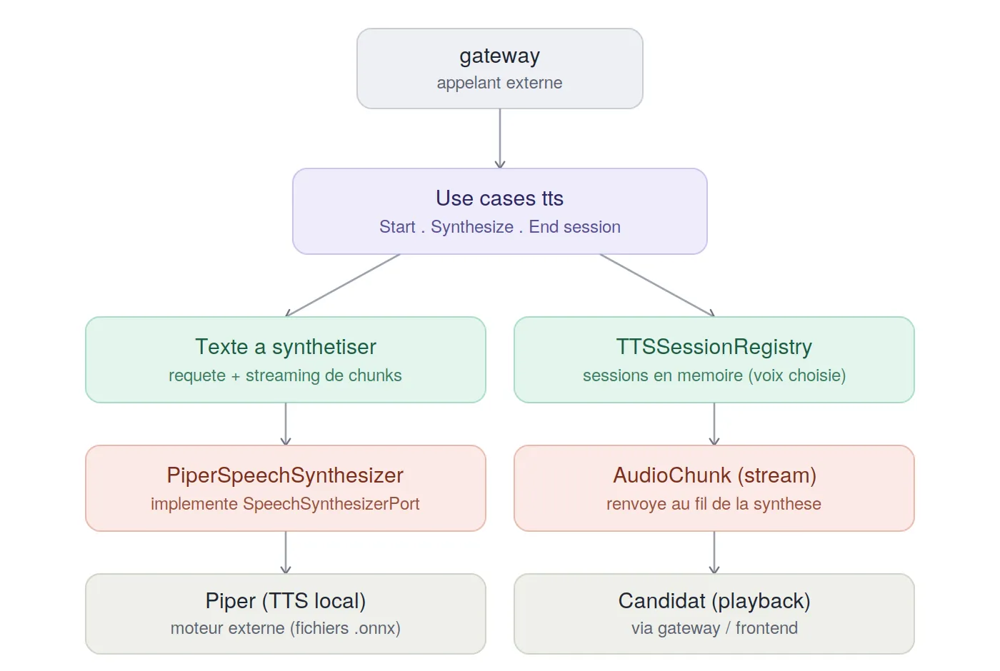

# Module `tts`

## Rôle

La voix de l'intervieweur. Ce module transforme le texte produit par
`agent` (message d'accueil, question suivante) en audio, diffusé en
streaming vers le candidat au fur et à mesure de la synthèse — pas
d'attente de la phrase complète avant de commencer à parler.

C'est le pendant symétrique du module `asr` : là où `asr` transforme la
voix du candidat en texte, `tts` transforme le texte de l'agent en voix.

## Schéma



## Déroulement d'une synthèse

1. **Démarrage de session** — au lancement de l'entretien, le `gateway`
   appelle `StartTTSSessionUseCase.executer(session_id, voice)`. La voix
   est fixée une fois pour toutes pour la session (ex:
   `fr_FR-siwis-medium`), stockée dans une `TTSSession` en mémoire.

2. **À chaque message de l'agent** — `SynthesizeTextUseCase.executer(session_id,
   texte)` est appelé (généralement juste après le message d'accueil ou
   chaque nouvelle question, côté `RequestVoiceResponseUseCase` du
   `gateway`). Le use case retrouve la voix associée à la session, puis
   délègue au port `SpeechSynthesizerPort.synthetiser(texte, voice)`, qui
   est un générateur asynchrone : chaque morceau audio produit par Piper
   est immédiatement enveloppé dans un `AudioChunk` et **yield**é au fur
   et à mesure, sans attendre la fin de la synthèse complète.

3. **Le moteur Piper tourne dans un thread séparé** — `PiperVoice.synthesize(...)`
   est bloquant et n'est pas nativement asynchrone. L'adapter le lance
   dans un thread (`loop.run_in_executor`) et fait communiquer ce thread
   avec la boucle asyncio via une `asyncio.Queue` : chaque chunk produit
   par Piper est poussé dans la queue (`call_soon_threadsafe`), et la
   coroutine principale les relit un par un jusqu'à un signal de fin
   (`None`). C'est ce qui permet au reste du pipeline de commencer à
   diffuser l'audio dès les premiers mots synthétisés, pendant que Piper
   continue de produire la suite de la phrase.

4. **Rééchantillonnage à la volée** — Piper ne synthétise pas
   nécessairement à 16 kHz nativement (dépend du modèle de voix
   utilisé). Chaque chunk est rééchantillonné vers `SAMPLE_RATE_CIBLE =
   16_000` avant d'être renvoyé, via interpolation linéaire
   (`np.interp`), pour rester cohérent avec le reste du pipeline audio
   (ASR, gateway, playback frontend), qui tourne entièrement à 16 kHz.

5. **Fin de session** — `EndTTSSessionUseCase.executer(session_id)`
   supprime simplement la session du registre en mémoire.

## Comportement du module

- **Sans état durable** : comme `asr`, ce module garde ses sessions
  uniquement en mémoire (`TTSSessionRegistry`) — aucune dépendance à
  `storage`. La voix de chaque session est perdue si le serveur redémarre
  en cours d'entretien.
- **Streaming de bout en bout** : la latence perçue par le candidat
  dépend de la rapidité à laquelle le premier chunk sort de Piper, pas de
  la longueur totale du texte à synthétiser — le module ne bufferise
  jamais l'intégralité de l'audio avant de commencer à répondre.
- **Une voix chargée une seule fois par modèle** : `PiperVoice.load(...)`
  est coûteux (chargement du modèle `.onnx`) ; l'adapter garde un cache
  des voix déjà chargées (`_voix_chargees`), indexé par nom de voix, pour
  ne payer ce coût qu'une fois même si plusieurs sessions utilisent la
  même voix.

## Architecture

Le module suit une architecture hexagonale (ports & adapters) :

- `domain/entities/` — `TTSSession` (état minimal d'une session : quelle
  voix utiliser)
- `domain/ports/` — `SpeechSynthesizerPort` (contrat de synthèse,
  streaming de `bytes`) et `TTSSessionRepositoryPort` (contrat de
  persistance de session, en mémoire)
- `application/use_cases/` — `StartTTSSessionUseCase`,
  `SynthesizeTextUseCase`, `EndTTSSessionUseCase`
- `infrastructure/adapters/` — `PiperSpeechSynthesizer` (implémentation
  réelle via Piper) et `TTSSessionRegistry` (registre en mémoire, simple
  dictionnaire)
- `composition_root.py` — assemble les trois use cases avec leurs
  adapters réels (`TTSContainer`), pour un câblage centralisé du module

## Points d'entrée exposés

- `StartTTSSessionUseCase.executer(session_id, voice)`
- `SynthesizeTextUseCase.executer(session_id, texte)` — générateur
  asynchrone d'`AudioChunk`
- `EndTTSSessionUseCase.executer(session_id)`

## Ports requis (ce dont ce module a besoin de l'extérieur)

- **Piper** (moteur TTS local) — fichiers de voix au format `.onnx`,
  chargés depuis `voices_dir` (configuré via `PIPER_VOICES_DIR` dans le
  `.env`), aucun appel réseau ni service distant
- Aucune dépendance vers `storage`, `agent`, ou `asr` : ce module ne
  connaît que le texte qu'on lui donne et la voix associée à la session

## Utilisation en développement

```bash
python -m tts.dev_runner
```

Synthétise une phrase de test (`"Bonjour, pouvez-vous vous présenter
?"`) avec la voix `fr_FR-siwis-medium`, en utilisant le vrai moteur
Piper via `TTSContainer`, et écrit le résultat dans `sortie_test.wav`
(mono, 16 kHz, 16 bits) — utile pour vérifier rapidement qu'une voix se
charge correctement et que l'audio produit est audible, indépendamment
du reste du pipeline (gateway, WebSocket, frontend).

## Adapters disponibles

- `PiperSpeechSynthesizer` — implémentation unique et actuelle du port,
  synthèse locale via Piper, streaming par thread + `asyncio.Queue`,
  rééchantillonnage systématique vers 16 kHz par interpolation linéaire

## Règles métier principales

- **La voix est fixée à la création de la session**, non modifiable en
  cours d'entretien — cohérent avec `agent`, où la langue est également
  figée au démarrage.
- **Le format audio de sortie est toujours du PCM à 16 kHz**, quelle que
  soit la fréquence native du modèle de voix Piper utilisé — c'est ce
  qui garantit la compatibilité avec le reste de la chaîne audio du
  projet.
- **Aucune logique de contenu** : ce module ne décide jamais quoi dire,
  seulement comment le dire — le texte lui arrive déjà entièrement
  formé depuis `agent`.

## Points à vérifier

- `composition_root.py` (`TTSContainer`) assemble déjà proprement les
  trois use cases avec leurs adapters réels, mais `server.py`
  (`ApplicationContainer`) ne l'utilise pas : le câblage y est refait à
  la main (`StartTTSSessionUseCase(tts_repo)`,
  `SynthesizeTextUseCase(synthesizer, tts_repo)`,
  `EndTTSSessionUseCase(tts_repo)`), en double de ce que
  `composition_root.py` fait déjà. Pas bloquant, mais les deux
  câblages peuvent diverger silencieusement si l'un est modifié sans
  l'autre.
- `SynthesizeTextUseCase.executer` construit chaque `AudioChunk` avec
  `is_final=False` et sans `sequence_number`, alors que le même type
  `AudioChunk` est construit ailleurs dans le projet (module `gateway`,
  côté réception audio candidat) avec `sequence_number` et sans
  `is_final`. À vérifier que `shared.domain.AudioChunk` accepte bien les
  deux usages (champs optionnels des deux côtés) sans effet de bord.
- Le rééchantillonnage par interpolation linéaire (`np.interp`) est
  simple et correct pour un **suréchantillonnage**, mais moins rigoureux
  qu'un vrai filtre pour un **sous-échantillonnage** (risque de
  repliement spectral si jamais une voix Piper native est à une
  fréquence supérieure à 16 kHz) — même famille de risque que le bug de
  downsampling déjà corrigé côté frontend, à surveiller si une voix plus
  haute résolution est ajoutée un jour.

## Statut

Le flux complet a été validé avec le vrai moteur Piper : chargement
d'une voix, synthèse en streaming, rééchantillonnage vers 16 kHz, et
écriture d'un fichier `.wav` exploitable (`dev_runner.py`). Le module
est fonctionnel de bout en bout ; les points relevés ci-dessus sont des
améliorations de cohérence, pas des bugs bloquants connus.